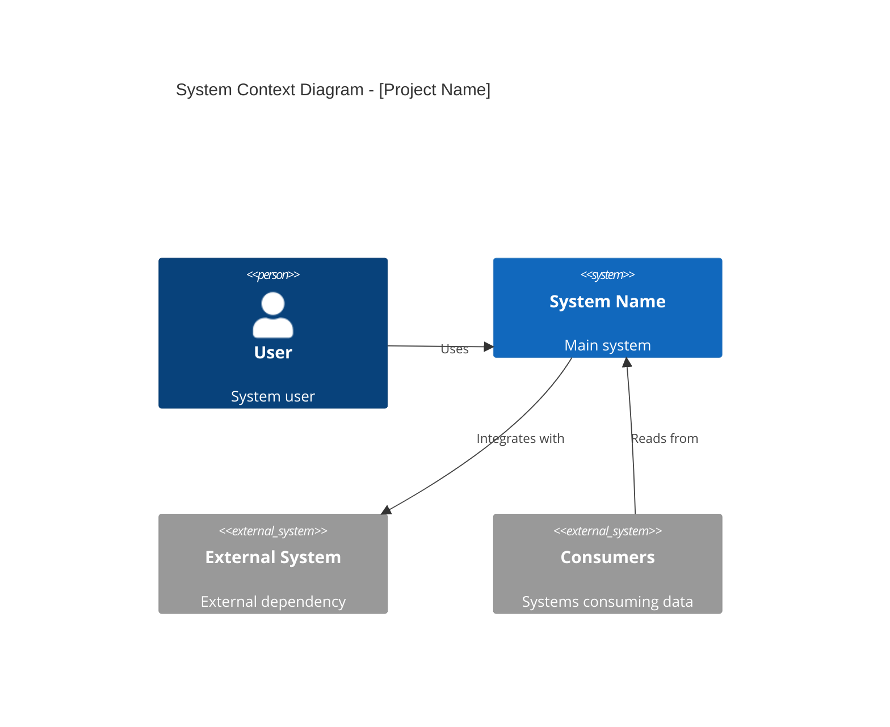
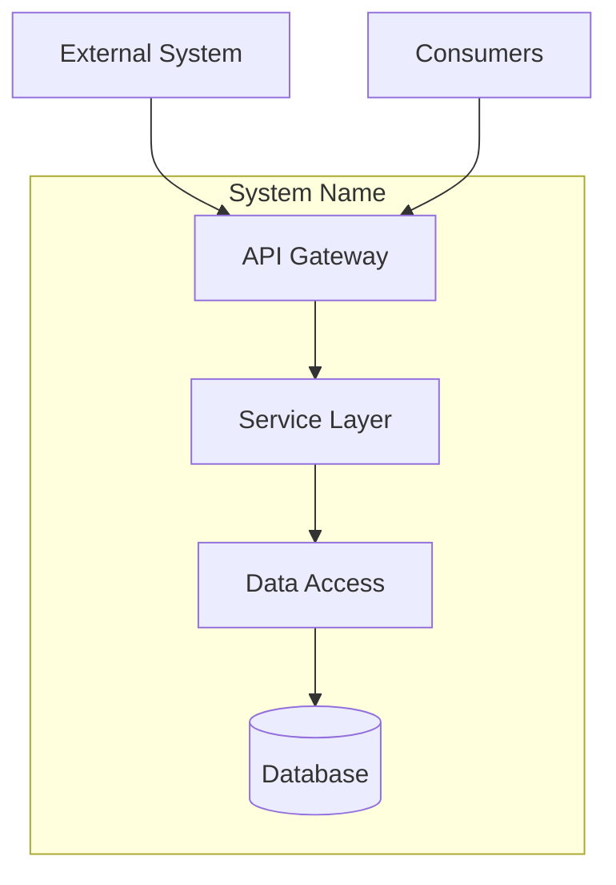
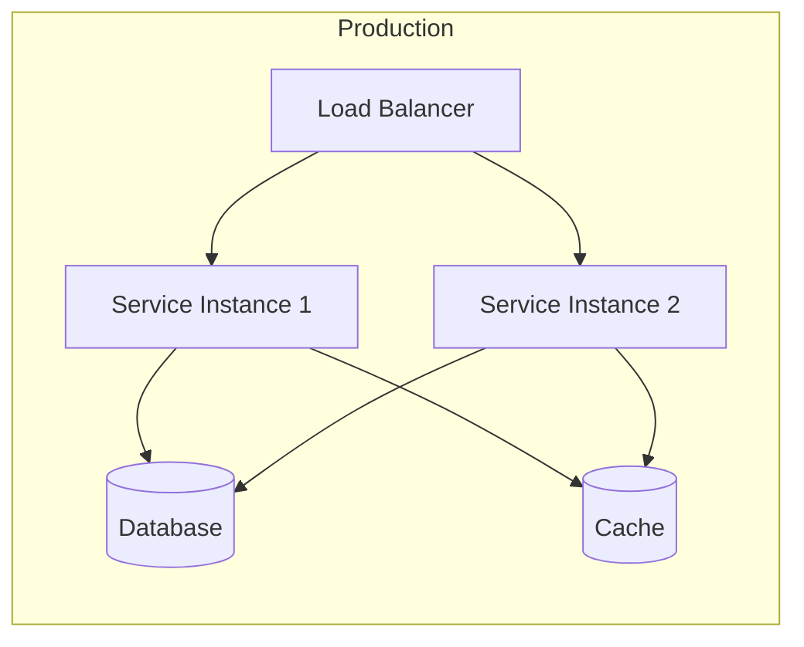

# Architecture Document

## Overview
- **Project**: [Project Name]
- **Date**: [Date]
- **Version**: 1.0
- **Brainstorming Reference**: [brainstorming.md](brainstorming.md)
- **Requirements Reference**: [requirements.md](requirements.md)

## System Context

### Overview
[High-level description of the system and its environment]

### Context Diagram

### External Interfaces
| System | Purpose | Protocol | Data Format |
|--------|---------|----------|-------------|
| | | | |

---

## Component Architecture

### Component Diagram

### Components

#### Component 1: [Name]
- **Responsibility**: 
- **Technology**: 
- **Interfaces**: 
- **Dependencies**: 

#### Component 2: [Name]
- **Responsibility**: 
- **Technology**: 
- **Interfaces**: 
- **Dependencies**: 

#### Component 3: [Name]
- **Responsibility**: 
- **Technology**: 
- **Interfaces**: 
- **Dependencies**: 

---

## Technology Stack

| Layer | Technology | Rationale |
|-------|------------|-----------|
| Language | | |
| Framework | | |
| API | | |
| Business Logic | | |
| Caching | | |
| Database | | |
| Messaging | | |
| Logging | | |
| Infrastructure | | |

---

## Key Design Decisions

See ADRs in `adr/` folder:
- [ADR-0001](adr/0001-decision-title.md): [Decision Title]
- [ADR-0002](adr/0002-decision-title.md): [Decision Title]

---

## Security Architecture

### Authentication
[Authentication method and flow]

### Authorization
[Authorization model]

### Data Protection
- Encryption at rest: 
- Encryption in transit: 

### Audit Logging
[What gets logged]

---

## Deployment Architecture

### Environments
| Environment | Purpose | URL |
|-------------|---------|-----|
| Development | | |
| Staging | | |
| Production | | |

---

## Cross-Cutting Concerns

### Logging
- Framework: 
- Log levels: 
- Structured logging: 

### Monitoring
- Metrics: 
- Dashboards: 
- Alerts: 

### Error Handling
- Error format: 
- Retry policy: 
- Circuit breaker: 

---

## Scalability Considerations

### Horizontal Scaling
- 

### Caching Strategy
- 

### Database Scaling
- 

---

## Sign-off

| Role | Name | Date | Signature |
|------|------|------|-----------|
| Architect | | | |
| Tech Lead | | | |
