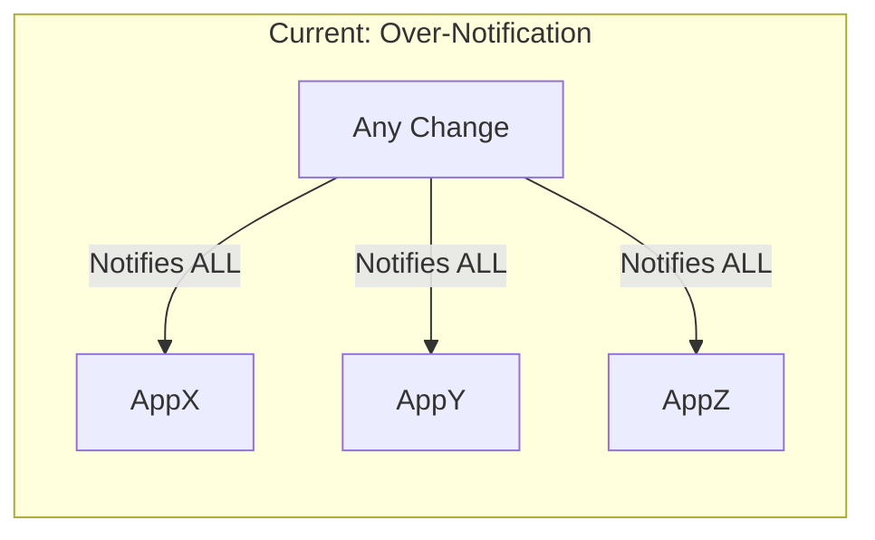
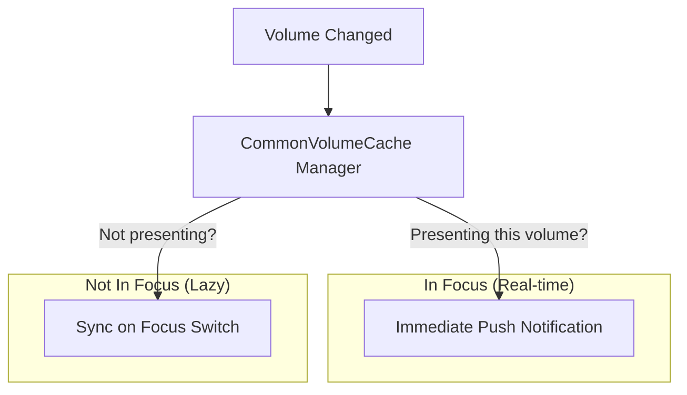
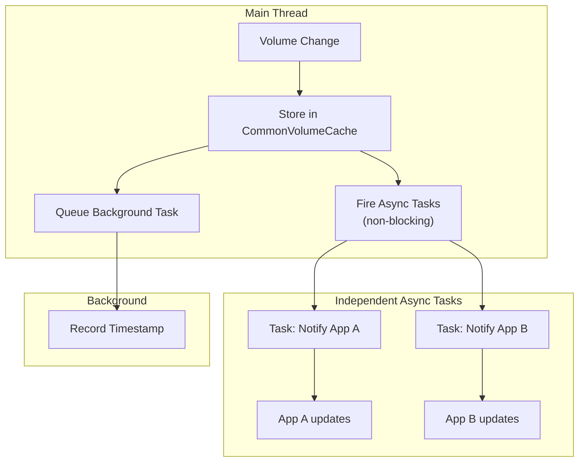
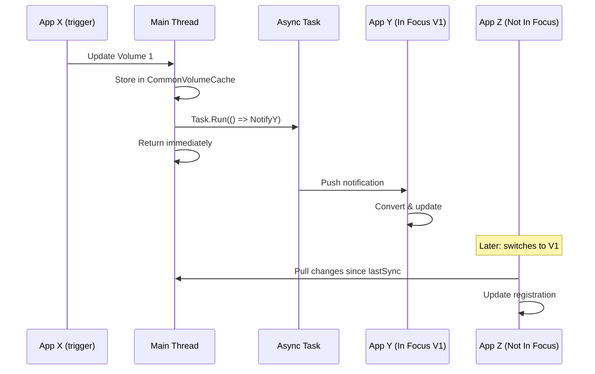
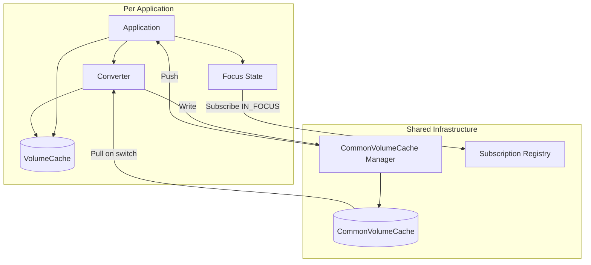

# Distribution Data Cache & Sync - Executive Summary

> For design review presentations and stakeholder communication

---

## Problem Statement

| Current State | Impact |
|--------------|--------|
| Single shared cache for all apps | Cache pollution with app-specific data |
| All apps notified on any change | Unnecessary processing, performance issues |
| No selective volume interest | Apps react to irrelevant changes |



---

## Goal

| Requirement | Description |
|-------------|-------------|
| VolumeCaches | Each app owns its cache for app-specific objects |
| CommonVolumeCache | Shared data only - no app-specific pollution |
| Smart notifications | Only notify apps presenting the changed volume |
| No cyclic updates | App that triggers change is not notified back |

---

## Approaches Evaluated

| # | Approach | Description | Score | Verdict |
|---|----------|-------------|-------|---------|
| 1 | **Full Push Subscription** | All subscribed apps get real-time push for every change | 159/200 | Good, but inefficient for many volumes |
| 2 | **Two-Tier Subscription** | Real-time for "In Focus" + lazy sync for "Not In Focus" | 155/200 | ✅ **Recommended** |
| 3 | **Pull-On-Switch** | No push - apps sync when switching volumes | 126/200 | ❌ Fails real-time requirement |
| 4 | **Event Sourcing** | Store all changes as events, apps replay | 103/200 | ❌ Over-engineering |

### Evaluation Criteria

| Criteria | Weight | Why It Matters |
|----------|--------|----------------|
| Meets must-have requirements | 5 | Non-negotiable |
| Real-time for active volume | 4 | Core UX requirement |
| Simplicity | 3 | Maintenance cost |
| Notification efficiency | 3 | Performance |
| Maintainability | 3 | Long-term cost |
| Migration effort | 2 | Transition risk |
| Team familiarity | 2 | Learning curve |

---

## Recommendation: Two-Tier Subscription

### Concept



### How It Works

| Level | Execution | Behavior |
|-------|-----------|----------|
| **In Focus** | Async fire-and-forget from main thread | Each app notified independently, non-blocking |
| **Not In Focus** | Separate background task | Records timestamp; app pulls on focus switch |

### Execution Model (ADR-0001)



**Key Point:** Each In Focus notification is an **independent async task** - one slow/blocked app cannot delay others.

### Key Flow



### Why This Approach?

| Factor | Reasoning |
|--------|-----------|
| **Real-time for active** | Users see changes immediately on presenting volume |
| **Non-blocking** | Async fire-and-forget prevents one app blocking others |
| **Efficient** | No wasted notifications to non-presenting apps |
| **Independent failures** | One app crash doesn't affect other notifications |
| **Incremental migration** | Can implement push first, add pull-on-switch later |

---

## Architecture Overview



---

## Key Components

| Component | Responsibility |
|-----------|----------------|
| **VolumeCache** | App-specific objects, per application |
| **CommonVolumeCache** | Shared data objects only, keyed by Volume ID |
| **Subscription Registry** | Tracks who is IN_FOCUS for which volumes |
| **CommonVolumeCache Manager** | Orchestrates writes and notifications |
| **Converter** | App-specific: transforms common ↔ app format |
| **Focus State Manager** | Per-app: tracks which volumes are presented |

---

## Write & Read Paths

### Write Path
```
App updates object
    → Update VolumeCache
    → Convert to Common format
    → Update CommonVolumeCache
    → Notify IN_FOCUS subscribers (except trigger app)
```

### Read Path (on notification)
```
CommonVolumeCache changed
    → Manager checks Subscription Registry
    → For each IN_FOCUS app (except trigger):
        → Push notification
        → App reads Common
        → App converts to own format
        → App updates VolumeCache
        → App reflects in UI
```

### Sync Path (on focus switch)
```
App switches to Volume X
    → Compare timestamps (Common vs Private)
    → If stale: Fetch from Common, Convert, Update Private
    → Present to user
```

---

## POC Scope

| Aspect | Scope |
|--------|-------|
| **Apps** | 2 applications (X and Y) |
| **Volumes** | 3 test volumes |
| **Duration** | 2-3 weeks |
| **Include** | Registry, Focus Manager, Push path, Pull-on-switch |
| **Exclude** | Full migration, Performance tuning, Monitoring |

### Success Criteria

| Metric | Target |
|--------|--------|
| In Focus update latency | < 100ms |
| Focus switch sync time | < 500ms |
| Cyclic notifications | Zero |
| Race condition handling | Graceful |

---

## Risks & Mitigations

| Risk | Impact | Mitigation |
|------|--------|------------|
| Two code paths | Medium | Clear separation, good test coverage |
| Focus state bugs | Low | State machine pattern, logging |
| Race on subscribe/unsubscribe | Medium | Locking or queue-based |

---

## Next Steps

1. [ ] Review with team
2. [ ] Validate assumptions with app teams
3. [ ] Approve approach
4. [ ] Define detailed requirements
5. [ ] Begin POC implementation

---

## References

- Full brainstorming: [brainstorming.md](brainstorming.md)
- Status tracking: [STATUS.md](STATUS.md)
