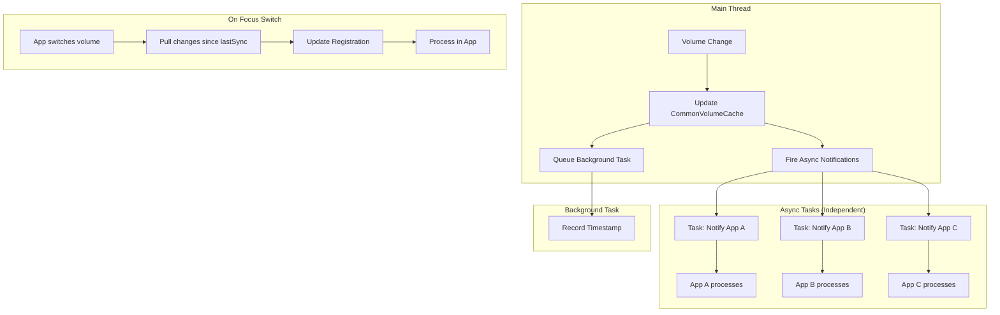

# ADR-0001: Async Notification Execution Model

## Status

**Accepted**

## Date

2026-03-22

## Context

In Approach 2 (Two-Tier Subscription), we need to decide how to execute notifications to subscribed applications when a volume changes. 

Key concerns:
1. One slow or blocked app should NOT delay notifications to other apps
2. The triggering app should not wait for all notifications to complete
3. Background (not in focus) updates should not block real-time notifications
4. Focus switch should be handled cleanly with registration updates

## Decision

We will use an **async fire-and-forget pattern** for In Focus notifications, with a **separate background task** for Not In Focus handling.

### Execution Model

```
Change occurs on Main Thread
    │
    ├─► Update CommonVolumeCache (sync)
    │
    ├─► For each IN_FOCUS subscriber (except trigger):
    │       └─► Task.Run(() => NotifyApp) ──► Independent async
    │                                         (non-blocking)
    │
    └─► Queue Background Task ──► Handle NOT_IN_FOCUS timestamps
```

### In Focus Notifications

```csharp
// Main thread - non-blocking
foreach (var subscriber in inFocusSubscribers.Except(triggeredBy))
{
    // Fire and forget - each app processes independently
    _ = Task.Run(async () => 
    {
        try
        {
            await NotifyAppAsync(subscriber, volumeId, changeData);
        }
        catch (Exception ex)
        {
            // Log but don't fail others
            _logger.LogError(ex, "Failed to notify {App}", subscriber);
        }
    });
}
```

**Characteristics:**
- Starts from main thread
- Each notification is an independent async task
- One app failure/slowness doesn't affect others
- Main thread returns immediately after queuing all tasks
- No await - true fire-and-forget

### Not In Focus (Background) Handling

```csharp
// Separate background task
_ = Task.Run(async () =>
{
    // Record timestamp for this volume change
    await _timestampTracker.RecordChange(volumeId, DateTime.UtcNow, changeData);
});
```

**On Focus Switch:**
```csharp
public async Task SwitchFocus(string appId, string newVolumeId, string oldVolumeId)
{
    // 1. Update registration
    await _registry.Unsubscribe(appId, oldVolumeId, FocusLevel.InFocus);
    await _registry.Subscribe(appId, newVolumeId, FocusLevel.InFocus);
    
    // 2. Pull any missed changes
    var lastSync = await _timestampTracker.GetLastSync(appId, newVolumeId);
    var changes = await _CommonVolumeCache.GetChangesSince(newVolumeId, lastSync);
    
    if (changes.Any())
    {
        // App converts and updates its VolumeCache
        return changes;
    }
    
    return null; // No changes needed
}
```

### Flow Diagram



## Consequences

### Positive

- **Isolation**: One slow/blocked app cannot affect others
- **Non-blocking**: Main thread returns immediately
- **Independent failures**: App X crash doesn't prevent App Y notification
- **Clean separation**: Real-time notifications vs background timestamp tracking
- **Efficient**: Background volumes only pull when needed

### Negative

- **No guaranteed ordering**: Notifications are concurrent, order not guaranteed
- **Fire-and-forget risks**: Need robust error handling/logging
- **Potential race on switch**: App might switch while notification in flight

### Neutral

- More async code to manage
- Need good logging for debugging async issues

## Alternatives Considered

### Alternative 1: Sequential Sync Notifications

**Description:** Notify each app synchronously in sequence

**Pros:**
- Simple, predictable ordering
- Easy to debug

**Cons:**
- One slow app blocks all others
- High latency for later apps in queue

**Why rejected:** Violates requirement that apps should be independent

### Alternative 2: Parallel Await All

**Description:** `await Task.WhenAll(notifications)`

**Pros:**
- Still parallel
- Know when all complete

**Cons:**
- Main thread waits for slowest app
- Still coupled to subscriber performance

**Why rejected:** Triggering app shouldn't wait for subscribers

### Alternative 3: Message Queue (e.g., RabbitMQ)

**Description:** Publish to queue, apps consume independently

**Pros:**
- True decoupling
- Built-in retry/dead letter
- Scalable

**Cons:**
- Infrastructure overhead
- More complexity for in-process scenario
- Latency for real-time requirement

**Why rejected:** Over-engineering for current scale; can migrate later if needed

## Related Decisions

- [Brainstorming](../brainstorming.md) - Approach 2 selection
- Future: ADR for error handling strategy

## Notes

### Error Handling Strategy

For fire-and-forget notifications:
```csharp
_ = Task.Run(async () => 
{
    try
    {
        await NotifyAppAsync(subscriber, volumeId, data);
    }
    catch (Exception ex)
    {
        _logger.LogError(ex, "Notification failed for {App} on {Volume}", 
            subscriber, volumeId);
        
        // Option: Add to retry queue
        // await _retryQueue.Enqueue(new FailedNotification(...));
    }
});
```

### Race Condition on Switch

If App X is switching focus from V1 to V2 while a V1 notification is in flight:
- Notification arrives for V1 (old focus)
- App should check if still interested before processing
- Or: Use timestamp to determine if change was before/after switch

```csharp
// In app notification handler
public async Task HandleNotification(string volumeId, ChangeData data)
{
    if (!_focusManager.IsInFocus(volumeId))
    {
        // Switched away - ignore, will pull on next switch
        return;
    }
    
    await ProcessChangeAsync(volumeId, data);
}
```
