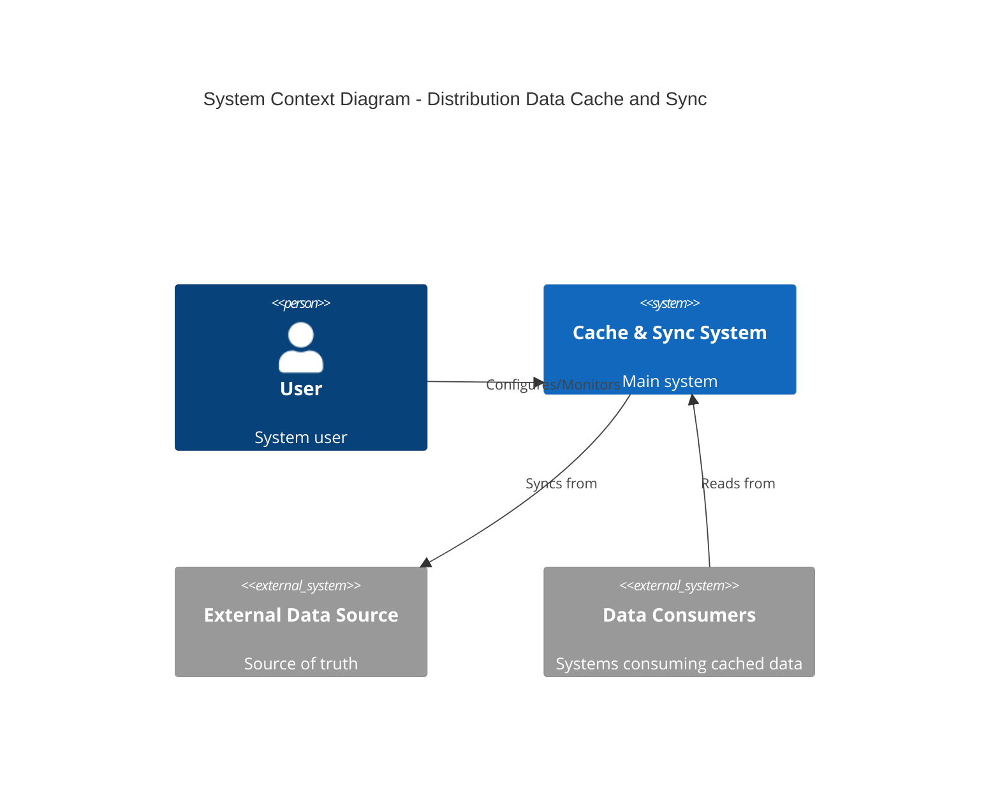
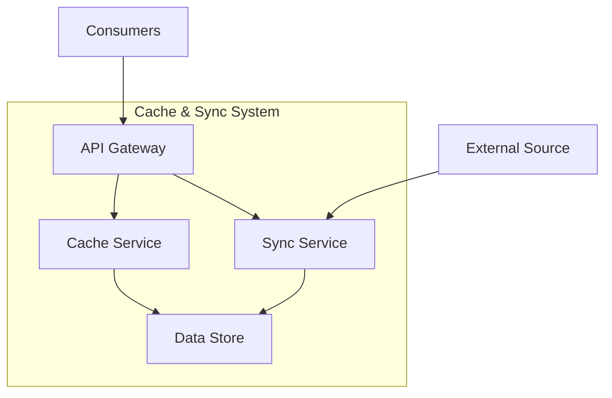
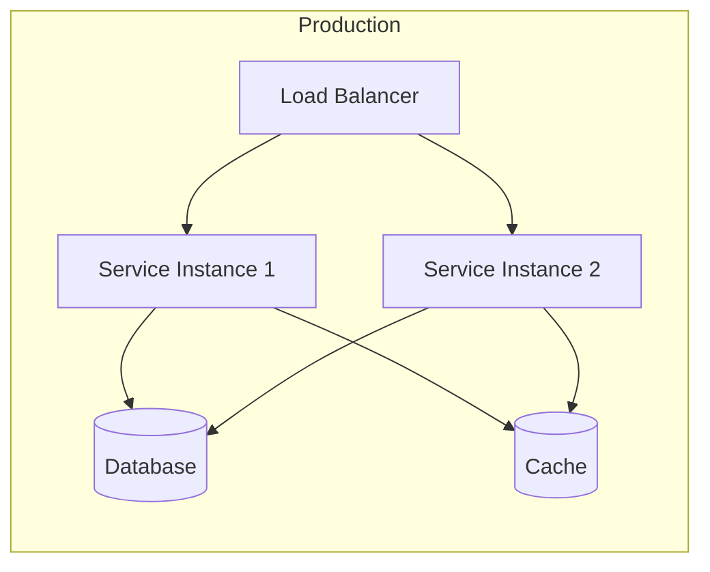

# Architecture Document

## System Context

### Overview
[High-level description of the system and its environment]

### Context Diagram

### External Interfaces
| System | Purpose | Protocol | Data Format |
|--------|---------|----------|-------------|
| | | | |

---

## Component Architecture

### Component Diagram

### Components

#### Component 1
- **Responsibility**: 
- **Technology**: 
- **Interfaces**: 
- **Dependencies**: 

#### Component 2
- **Responsibility**: 
- **Technology**: 
- **Interfaces**: 
- **Dependencies**: 

---

## Technology Stack

| Layer | Technology | Rationale |
|-------|------------|-----------|
| API | | |
| Business Logic | | |
| Caching | | |
| Database | | |
| Messaging | | |
| Infrastructure | | |

---

## Key Design Decisions
See ADRs in `adr/` folder:
- [ADR-001](adr/ADR-001-template.md): [Decision Title]

---

## Security Architecture
[Security considerations and controls]

- Authentication: 
- Authorization:
- Data encryption:
- Audit logging:

---

## Deployment Architecture

---

## Scalability Considerations
- Horizontal scaling:
- Caching strategy:
- Database scaling:

---

## Sign-off

| Role | Name | Date | Signature |
|------|------|------|-----------|
| Architect | | | |
| Tech Lead | | | |
