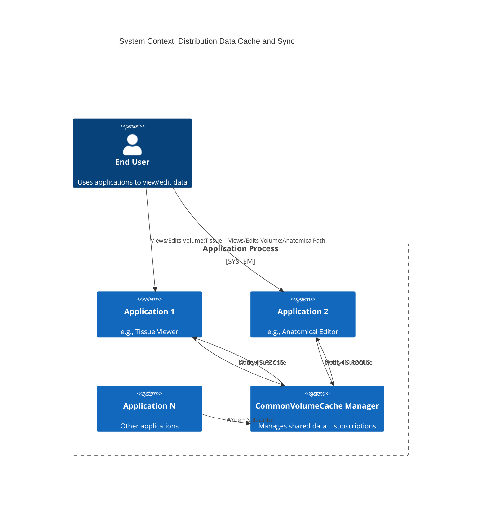
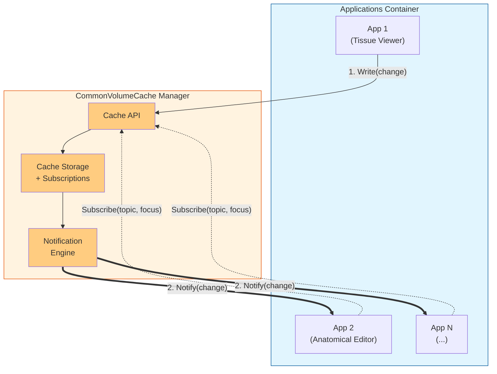
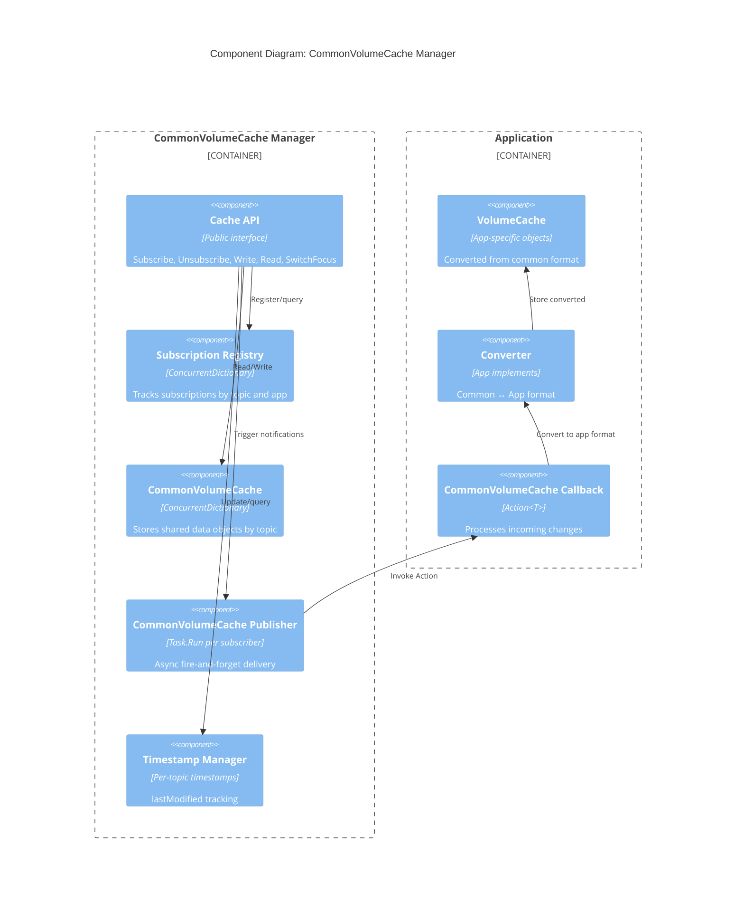
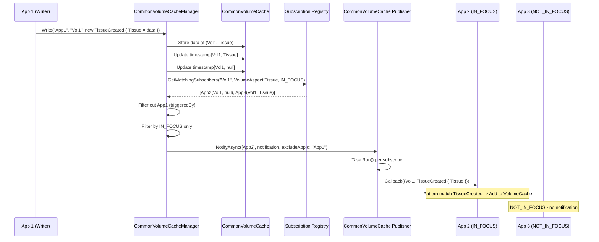
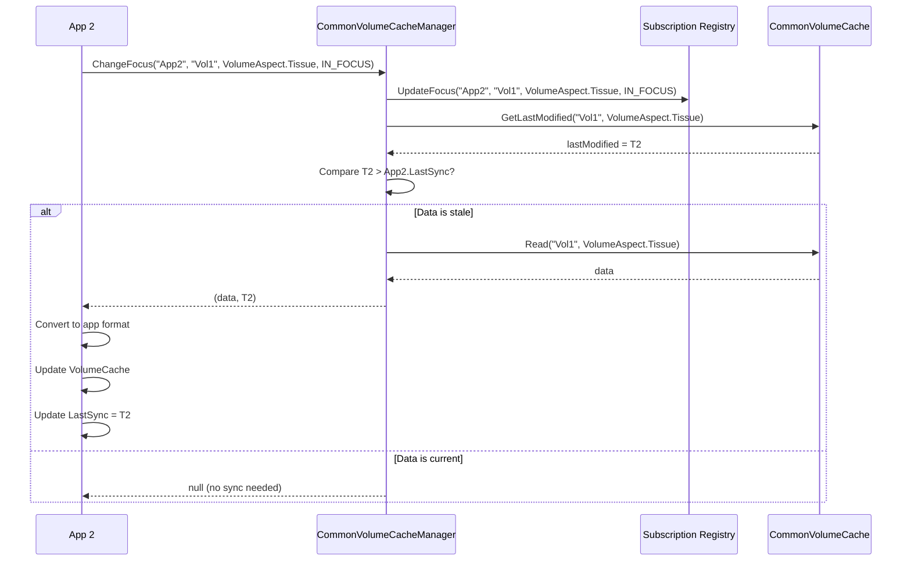

# Architecture: Distribution Data Cache and Sync Framework

**Date:** 2026-03-23
**Version:** 1.3
**Status:** Draft
**Phase:** Architecture

---

## Technology Stack

| Layer | Technology | Rationale |
|-------|------------|-----------|
| **Language** | C# / .NET | Existing codebase, team expertise |
| **Cache** | In-memory (`ConcurrentDictionary`) | Simple, fast, sufficient for single-process |
| **Subscriptions** | Registry pattern with Action delegates | No events; explicit app identity (ADR-0002) |
| **Threading** | `Task.Run()` for async notifications | Fire-and-forget per ADR-0001 |
| **Concurrency** | `ConcurrentDictionary`, `lock` where needed | Thread-safe collections |
| **Logging** | Microsoft.Extensions.Logging | Standard .NET logging |

### Why NOT Event Handlers

Per **ADR-0002**, we avoid C# events because:
- Events don't carry subscriber identity (can't filter self-notifications)
- Multicast delegates complicate per-subscriber error handling
- Can't associate rich metadata (topic, focus level) with event handlers

---

## System Context Diagram



---

## High-Level Conceptual Design



### Concept Summary

| Flow | Description |
|------|-------------|
| **Subscribe** | Applications register interest in specific topics with a focus level |
| **Write** | Writing app pushes changes to the cache; does NOT receive its own notification |
| **Notify** | All other subscribed apps (IN_FOCUS) receive async notifications |

---

## Component Diagram



---

## Layered Architecture

```
┌─────────────────────────────────────────────────────────────────┐
│                        APPLICATION LAYER                         │
│  ┌──────────────┐  ┌──────────────┐  ┌──────────────┐           │
│  │   App 1      │  │   App 2      │  │   App N      │           │
│  │ ┌──────────┐ │  │ ┌──────────┐ │  │ ┌──────────┐ │           │
│  │ │Private   │ │  │ │Private   │ │  │ │Private   │ │           │
│  │ │Cache     │ │  │ │Cache     │ │  │ │Cache     │ │           │
│  │ └──────────┘ │  │ └──────────┘ │  │ └──────────┘ │           │
│  │ ┌──────────┐ │  │ ┌──────────┐ │  │ ┌──────────┐ │           │
│  │ │Converter │ │  │ │Converter │ │  │ │Converter │ │           │
│  │ └──────────┘ │  │ └──────────┘ │  │ └──────────┘ │           │
│  └──────────────┘  └──────────────┘  └──────────────┘           │
└─────────────────────────────────────────────────────────────────┘
                              │
                    Subscribe │ Write │ Read
                              ▼
┌─────────────────────────────────────────────────────────────────┐
│                     FRAMEWORK LAYER                              │
│  ┌───────────────────────────────────────────────────────────┐  │
│  │                   CommonVolumeCache Manager                     │  │
│  │  ┌─────────────────┐  ┌─────────────────┐                 │  │
│  │  │ Subscription    │  │ CommonVolumeCache    │                 │  │
│  │  │ Registry        │  │ (In-Memory)     │                 │  │
│  │  │                 │  │                 │                 │  │
│  │  │ Topic → [Entry] │  │ Topic → Data    │                 │  │
│  │  │ App → [Entry]   │  │                 │                 │  │
│  │  └─────────────────┘  └─────────────────┘                 │  │
│  │  ┌─────────────────┐  ┌─────────────────┐                 │  │
│  │  │ Notification    │  │ Timestamp       │                 │  │
│  │  │ Service         │  │ Manager         │                 │  │
│  │  │                 │  │                 │                 │  │
│  │  │ Task.Run()      │  │ Topic → DateTime│                 │  │
│  │  └─────────────────┘  └─────────────────┘                 │  │
│  └───────────────────────────────────────────────────────────┘  │
└─────────────────────────────────────────────────────────────────┘
```

---

## Key Interfaces

### ICommonVolumeCacheManager

```csharp
public interface ICommonVolumeCacheManager
{
    // Subscription Management
    void Subscribe(string appId, string volumeId, VolumeAspect? aspect, FocusLevel focus, Action<NotificationData> callback);
    void Unsubscribe(string appId, string volumeId, VolumeAspect? aspect = null);
    void ChangeFocus(string appId, string volumeId, VolumeAspect? aspect, FocusLevel newFocus);
    IEnumerable<SubscriptionInfo> GetMySubscriptions(string appId);
    
    // Write Path - type-safe change object
    void Write(string appId, string volumeId, IVolumeAspectChange change);
    
    // Read Path (for focus switch)
    (object Data, DateTime Timestamp)? Read(string volumeId, VolumeAspect? aspect = null);
    DateTime? GetLastModified(string volumeId, VolumeAspect? aspect = null);
}
```

### ISubscriptionRegistry

```csharp
public interface ISubscriptionRegistry
{
    void Add(SubscriptionEntry entry);
    void Remove(string appId, string volumeId, VolumeAspect? aspect);
    void UpdateFocus(string appId, string volumeId, VolumeAspect? aspect, FocusLevel newFocus);
    
    IEnumerable<SubscriptionEntry> GetByVolume(string volumeId, VolumeAspect? aspect = null, FocusLevel? focus = null);
    IEnumerable<SubscriptionEntry> GetByApp(string appId);
    IEnumerable<SubscriptionEntry> GetMatchingSubscribers(string volumeId, VolumeAspect aspect, FocusLevel focus);
}
```

### ICommonVolumeCachePublisher

```csharp
public interface ICommonVolumeCachePublisher
{
    void NotifyAsync(IEnumerable<SubscriptionEntry> subscribers, NotificationData data, string excludeAppId);
}
```

---

## Data Structures

### VolumeAspect Enum (Framework-Defined)

```csharp
/// <summary>
/// Defines the aspects/sub-domains of a volume.
/// Defined by the CommonVolumeCache Manager (framework).
/// Applications subscribe to specific aspects or to all (null = volume-level).
/// </summary>
public enum VolumeAspect
{
    Tissue,
    AnatomicalPath,
    TBD                 // Placeholder for future aspects
}
```

### ChangeType Enum

```csharp
/// <summary>
/// Indicates what type of change occurred to the data.
/// </summary>
public enum ChangeType
{
    Created,    // New item added
    Updated,    // Existing item modified
    Deleted     // Item removed
}
```

### IVolumeAspectChange Interface (Type-Safe Changes)

```csharp
/// <summary>
/// Base interface for all volume aspect changes.
/// Enables type-safe change handling with C# pattern matching.
/// </summary>
public interface IVolumeAspectChange
{
    VolumeAspect Aspect { get; }
    ChangeType ChangeType { get; }
}
```

### Tissue Change Classes

```csharp
/// <summary>
/// Common data for all Tissue objects.
/// </summary>
public class TissueData
{
    public required string TissueId { get; init; }
    public required string Name { get; init; }
    public required string Color { get; init; }
    // ... other tissue properties
}

/// <summary>
/// Base class for Tissue changes.
/// </summary>
public abstract class TissueChange : IVolumeAspectChange
{
    public VolumeAspect Aspect => VolumeAspect.Tissue;
    public abstract ChangeType ChangeType { get; }
    
    /// <summary>
    /// The full tissue data - always included for all change types.
    /// </summary>
    public required TissueData Tissue { get; init; }
}

public class TissueCreated : TissueChange
{
    public override ChangeType ChangeType => ChangeType.Created;
    // Tissue property inherited - contains the new tissue data
}

public class TissueUpdated : TissueChange
{
    public override ChangeType ChangeType => ChangeType.Updated;
    // Tissue property inherited - contains the updated tissue data
}

public class TissueDeleted : TissueChange
{
    public override ChangeType ChangeType => ChangeType.Deleted;
    // Tissue property inherited - contains the deleted tissue data
}
```

### AnatomicalPath Change Classes

```csharp
public class AnatomicalPathData
{
    public required string PathId { get; init; }
    public required List<Point3D> Points { get; init; }
    // ... other path properties
}

public abstract class AnatomicalPathChange : IVolumeAspectChange
{
    public VolumeAspect Aspect => VolumeAspect.AnatomicalPath;
    public abstract ChangeType ChangeType { get; }
    
    /// <summary>
    /// The full path data - always included for all change types.
    /// </summary>
    public required AnatomicalPathData Path { get; init; }
}

public class AnatomicalPathCreated : AnatomicalPathChange
{
    public override ChangeType ChangeType => ChangeType.Created;
}

public class AnatomicalPathUpdated : AnatomicalPathChange
{
    public override ChangeType ChangeType => ChangeType.Updated;
}

public class AnatomicalPathDeleted : AnatomicalPathChange
{
    public override ChangeType ChangeType => ChangeType.Deleted;
}
```

### SubscriptionKey

```csharp
/// <summary>
/// Composite key for subscription lookups.
/// </summary>
public readonly struct SubscriptionKey : IEquatable<SubscriptionKey>
{
    public string VolumeId { get; }
    public VolumeAspect? Aspect { get; }    // null = volume-level subscription (all aspects)
    
    public SubscriptionKey(string volumeId, VolumeAspect? aspect = null)
    {
        VolumeId = volumeId;
        Aspect = aspect;
    }
    
    // Equality based on VolumeId + Aspect
    public bool Equals(SubscriptionKey other) => 
        VolumeId == other.VolumeId && Aspect == other.Aspect;
        
    public override int GetHashCode() => HashCode.Combine(VolumeId, Aspect);
}
```

### SubscriptionEntry

```csharp
public class SubscriptionEntry
{
    public string AppId { get; }
    public string VolumeId { get; }
    public VolumeAspect? Aspect { get; }              // null = subscribe to ALL aspects of volume
    public FocusLevel FocusLevel { get; set; }
    public Action<NotificationData> Callback { get; }
    public DateTime SubscribedAt { get; }
    public DateTime LastSync { get; set; }      // For NOT_IN_FOCUS timestamp tracking
    
    public SubscriptionKey Key => new(VolumeId, Aspect);
}
```

### NotificationData

```csharp
public class NotificationData
{
    public string VolumeId { get; }             // The volume that changed
    public IVolumeAspectChange Change { get; }  // Type-safe change object with full data
    public string TriggeredBy { get; }          // App ID that made the change
    public DateTime Timestamp { get; }
    
    // Convenience properties derived from Change
    public VolumeAspect Aspect => Change.Aspect;
    public ChangeType ChangeType => Change.ChangeType;
}
```

### Subscriber Pattern Matching Example

```csharp
void OnNotification(NotificationData notification)
{
    switch (notification.Change)
    {
        case TissueCreated tc:
            // tc.Tissue contains the full new tissue data
            AddToPrivateCache(tc.Tissue);
            break;
            
        case TissueUpdated tu:
            // tu.Tissue contains the full updated tissue data
            UpdateInPrivateCache(tu.Tissue);
            break;
            
        case TissueDeleted td:
            // td.Tissue contains the full deleted tissue data
            RemoveFromPrivateCache(td.Tissue.TissueId);
            LogDeletedTissue(td.Tissue);  // Can still access all properties!
            break;
            
        case AnatomicalPathCreated ac:
            AddPath(ac.Path);
            break;
            
        case AnatomicalPathUpdated au:
            UpdatePath(au.Path);
            break;
            
        case AnatomicalPathDeleted ad:
            RemovePath(ad.Path.PathId);
            break;
    }
}
```

### FocusLevel

```csharp
public enum FocusLevel
{
    InFocus,        // Receives real-time push notifications
    NotInFocus      // No push; pull on focus switch
}
```

---

## Data Flow Diagrams

### Write Path (with IN_FOCUS notification)



### Focus Switch Path (Pull)



---

## Hierarchical Subscription Matching

When a write occurs to `(Volume1, VolumeAspect.Tissue)`:

```
Write("Volume1", new TissueUpdated { Tissue = updatedData })
    │
    ├── Notify subscribers[(Volume1, Tissue)]    (aspect subscribers)
    │
    └── Notify subscribers[(Volume1, null)]      (volume subscribers - ALL aspects)
    
Subscribers to (Volume1, AnatomicalPath) are NOT notified.
```

### Implementation

```csharp
public IEnumerable<SubscriptionEntry> GetMatchingSubscribers(string volumeId, VolumeAspect aspect, FocusLevel focus)
{
    var result = new List<SubscriptionEntry>();
    
    // 1. Direct aspect match: subscribers to (volumeId, aspect)
    var aspectKey = new SubscriptionKey(volumeId, aspect);
    if (_byKey.TryGetValue(aspectKey, out var aspectSubscribers))
        result.AddRange(aspectSubscribers.Where(s => s.FocusLevel == focus));
    
    // 2. Volume-level match: subscribers to (volumeId, null) - they want ALL aspects
    var volumeKey = new SubscriptionKey(volumeId, null);
    if (_byKey.TryGetValue(volumeKey, out var volumeSubscribers))
        result.AddRange(volumeSubscribers.Where(s => s.FocusLevel == focus));
    
    return result;
}
```

### Subscription Examples

```csharp
// Subscribe to ALL aspects of Volume1 (volume-level)
cacheManager.Subscribe("App1", "Volume1", aspect: null, FocusLevel.InFocus, callback);
// -> Receives notifications for ANY change to Volume1

// Subscribe to ONLY Tissue aspect of Volume1
cacheManager.Subscribe("App2", "Volume1", VolumeAspect.Tissue, FocusLevel.InFocus, callback);
// -> Receives notifications ONLY when Tissue changes

// Create new Tissue - full data included
var newTissue = new TissueData { TissueId = "T1", Name = "Liver", Color = "#8B0000" };
cacheManager.Write("App3", "Volume1", new TissueCreated { Tissue = newTissue });
// -> App1 & App2 receive TissueCreated with full Tissue data
// -> Subscriber pattern matches: case TissueCreated tc => AddToCache(tc.Tissue)

// Update Tissue (e.g., color change) - full data included
var updatedTissue = new TissueData { TissueId = "T1", Name = "Liver", Color = "#FF0000" };
cacheManager.Write("App3", "Volume1", new TissueUpdated { Tissue = updatedTissue });
// -> Subscribers receive TissueUpdated with full updated Tissue data
// -> Subscriber pattern matches: case TissueUpdated tu => UpdateInCache(tu.Tissue)

// Delete Tissue - full data still included!
var deletedTissue = new TissueData { TissueId = "T1", Name = "Liver", Color = "#FF0000" };
cacheManager.Write("App3", "Volume1", new TissueDeleted { Tissue = deletedTissue });
// -> Subscribers receive TissueDeleted with full Tissue data
// -> Subscriber can: RemoveFromCache(td.Tissue.TissueId) AND log td.Tissue.Name
```

---

## Thread Safety

| Component | Strategy |
|-----------|----------|
| Subscription Registry | `ConcurrentDictionary` + `lock` on list modifications |
| CommonVolumeCache | `ConcurrentDictionary` |
| Timestamp Manager | `ConcurrentDictionary` |
| Notification delivery | Each callback in separate `Task.Run()` |

---

## Architectural Decisions

| ADR | Decision | Reference |
|-----|----------|-----------|
| ADR-0001 | Async fire-and-forget notifications | [Link](adr/0001-async-notification-execution-model.md) |
| ADR-0002 | Registry-based subscriptions (no events) | [Link](adr/0002-registry-based-subscription-pattern.md) |

---

## Dependencies

```
Framework Components (this POC):
├── CommonVolumeCacheManager
├── SubscriptionRegistry  
├── CommonVolumeCachePublisher
└── TimestampManager

Application Responsibility:
├── VolumeCache (app manages internally)
├── Converter (app implements IConverter)
└── CommonVolumeCache Callback (app provides Action<T>)
```

---

## Sign-off

| Role | Name | Date | Approved |
|------|------|------|----------|
| Tech Lead | | | [ ] |
| Principal Engineer | | | [ ] |

---

## Revision History

| Version | Date | Author | Changes |
|---------|------|--------|---------|
| 1.0 | 2026-03-23 | | Initial architecture based on requirements v1.2 |
| 1.1 | 2026-03-23 | | Replaced string topic with VolumeId + Aspect enum. Added SubscriptionKey struct. |
| 1.2 | 2026-03-23 | | Renamed Aspect to VolumeAspect. Added ChangeType enum (Created/Updated/Deleted). |
| 1.3 | 2026-03-23 | | Added IVolumeAspectChange interface with type-safe change classes. All change types include full data. |