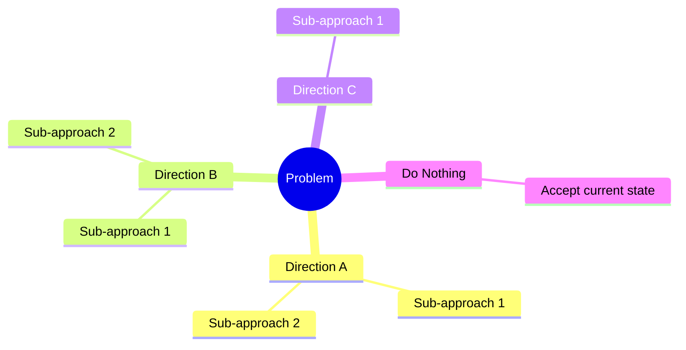
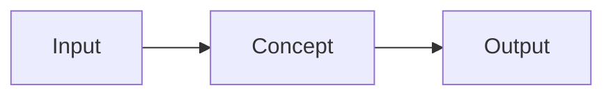
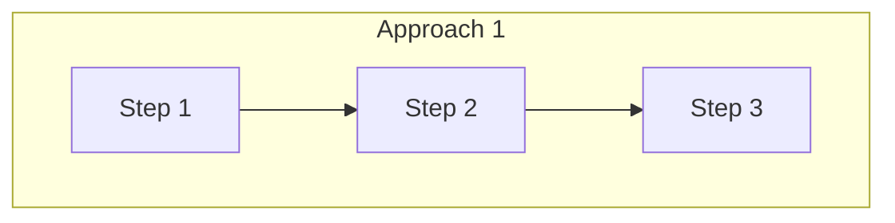
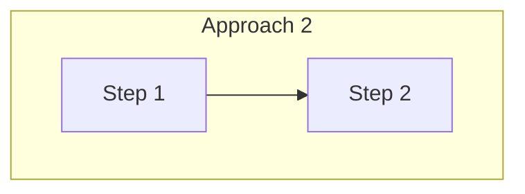

# Brainstorming: [Project/Feature Name]

**Date:** [Date]
**Participants:** [Names]
**Status:** [ ] In Progress | [ ] Completed | [ ] Approved

---

## Part 1: Problem Understanding 🎯

### The Challenge

#### What is the problem?
[Specific description - not symptoms, but root cause]

#### Why does this problem exist?
[Context and background]

#### Who is affected?

| Stakeholder | How Affected | Priority |
|-------------|--------------|----------|
| [Primary users] | [Impact] | High |
| [Secondary users] | [Impact] | Medium |
| [Systems] | [Impact] | |

#### Current State
[How things work today, if applicable]

#### What triggers this problem?
- Trigger 1
- Trigger 2

#### Impact of NOT Solving

| Category | Impact |
|----------|--------|
| Business | [cost, risk, opportunity loss] |
| Technical | [debt that gets worse] |
| User | [frustration, workarounds] |

### Success Criteria

#### Must Have (Non-negotiable)
- [ ] 
- [ ] 

#### Should Have (Important)
- [ ] 

#### Nice to Have (Bonus)
- [ ] 

#### Anti-Goals (NOT trying to achieve)
- Not trying to: 

### Constraints

#### Technical
- Must use: 
- Cannot use: 
- Must integrate with: 

#### Business
- Timeline: 
- Budget: 
- Team capacity: 

#### Compliance/Security
- Requirements: 

---

## Part 2: Directions Explored 🧭

### Direction Overview

### Direction 1: [Name]

**Concept:** [1-2 sentences]

**Initial Thoughts:**
- Why might this work?
- Why might this NOT work?
- Questions raised:

**Discussion Notes:**
[Key points from team discussion]

---

### Direction 2: [Name]

**Concept:** [1-2 sentences]

**Initial Thoughts:**
- Why might this work?
- Why might this NOT work?
- Questions raised:

**Discussion Notes:**

---

### Direction 3: [Name]

**Concept:** [1-2 sentences]

**Initial Thoughts:**
- Why might this work?
- Why might this NOT work?
- Questions raised:

**Discussion Notes:**

---

## Part 3: Detailed Approaches 📊

### Approach 1: [Name]

**Direction:** [Which high-level direction]

**Description:**
[2-3 paragraph explanation]

**How It Works:**

**Key Components:**

| Component | Responsibility | Technology Options |
|-----------|---------------|-------------------|
| | | |

#### Evaluation

**Pros ✅**

| Benefit | Impact | Confidence |
|---------|--------|------------|
| | H/M/L | High/Med/Low |

**Cons ❌**

| Drawback | Impact | Mitigation |
|----------|--------|------------|
| | H/M/L | |

**Risks ⚠️**

| Risk | Likelihood | Impact | Mitigation |
|------|------------|--------|------------|
| | H/M/L | H/M/L | |

**Complexity Assessment:**

| Dimension | Rating (1-5) | Notes |
|-----------|--------------|-------|
| Implementation effort | | |
| Maintenance burden | | |
| Learning curve | | |
| Integration complexity | | |
| Testing difficulty | | |
| **Total** | **/25** | |

**Best Suited When:**
- Condition 1
- Condition 2

**Avoid When:**
- Condition 1

---

### Approach 2: [Name]

**Direction:** [Which high-level direction]

**Description:**

**How It Works:**

#### Evaluation

**Pros ✅**

| Benefit | Impact | Confidence |
|---------|--------|------------|

**Cons ❌**

| Drawback | Impact | Mitigation |
|----------|--------|------------|

**Risks ⚠️**

| Risk | Likelihood | Impact | Mitigation |
|------|------------|--------|------------|

**Complexity Assessment:**

| Dimension | Rating (1-5) | Notes |
|-----------|--------------|-------|
| Implementation effort | | |
| Maintenance burden | | |
| Learning curve | | |
| Integration complexity | | |
| Testing difficulty | | |
| **Total** | **/25** | |

---

### Approach 3: [Name] (or "Do Nothing")

**Direction:** [Which high-level direction or "Accept Status Quo"]

**Description:**

#### Evaluation

**Pros ✅**

| Benefit | Impact | Confidence |
|---------|--------|------------|

**Cons ❌**

| Drawback | Impact | Mitigation |
|----------|--------|------------|

**Complexity Assessment:**

| Dimension | Rating (1-5) | Notes |
|-----------|--------------|-------|
| **Total** | **/25** | |

---

## Part 4: Decision 🏆

### Comparison Matrix

| Criteria | Weight | Approach 1 | Approach 2 | Approach 3 | Notes |
|----------|--------|------------|------------|------------|-------|
| Meets must-have criteria | 5 | ✅/❌ | ✅/❌ | ✅/❌ | Eliminates if ❌ |
| Performance | 3 | /10 | /10 | /10 | |
| Simplicity | 2 | /10 | /10 | /10 | |
| Maintainability | 3 | /10 | /10 | /10 | |
| Scalability | 2 | /10 | /10 | /10 | |
| Team familiarity | 2 | /10 | /10 | /10 | |
| Time to implement | 2 | /10 | /10 | /10 | |
| Cost | 1 | /10 | /10 | /10 | |
| **Weighted Score** | | **?** | **?** | **?** | |

### Recommendation

#### Chosen Approach: [Name]

#### Why This Over Others

| Rejected Approach | Primary Reason for Rejection |
|-------------------|------------------------------|
| | |

#### Key Factors in Decision
1. [Most important reason]
2. [Second reason]
3. [Third reason]

#### Risks We're Accepting

| Risk | Why We Accept It | How We'll Monitor |
|------|------------------|-------------------|
| | | |

#### Assumptions We're Making

- [ ] Assumption 1 - Validation: 
- [ ] Assumption 2 - Validation: 

### POC Scope (if needed)

**Goal:** [What are we trying to prove?]

**Scope:**
- Include: 
- Exclude: 

**Success Criteria:**
- [ ] Proves: 
- [ ] Proves: 

**Timeline:** [Expected duration]

---

## Approval

- [ ] Team reviewed all approaches
- [ ] Stakeholders agree with direction
- [ ] Risks acknowledged and accepted
- [ ] Ready to proceed to Requirements phase

**Approved by:** 
**Date:** 

---

## Appendix: Discussion Notes

> Preserve raw discussion notes for design review traceability

### Session 1 - [Date]

### Session 2 - [Date]

