# Brainstorming: Distribution Data Cache and Sync Framework

**Date:** 2026-03-22
**Participants:** [Team]
**Status:** [x] In Progress | [x] Completed | [x] Approved ✅

---

## Part 1: Problem Understanding 🎯

### The Challenge

#### What is the problem?

Multiple applications (X, Y, Z) share a single cache keyed by Volume ID. Each application stores:
- Its own app-specific objects (mapped to common format)
- Common data objects

**Problems with current design:**

1. **Mixed Cache Pollution**: One cache contains everyone's app-specific objects + common objects. Apps store data not relevant to other apps, polluting the shared cache.

2. **Over-Notification**: When App X changes Volume 1, ALL apps get notified - even if they're currently presenting Volume 2. This causes unnecessary processing and reactions to irrelevant changes.

3. **No Selective Interest**: Apps cannot specify which volumes they care about in real-time. They must process all change notifications.

#### Current Architecture

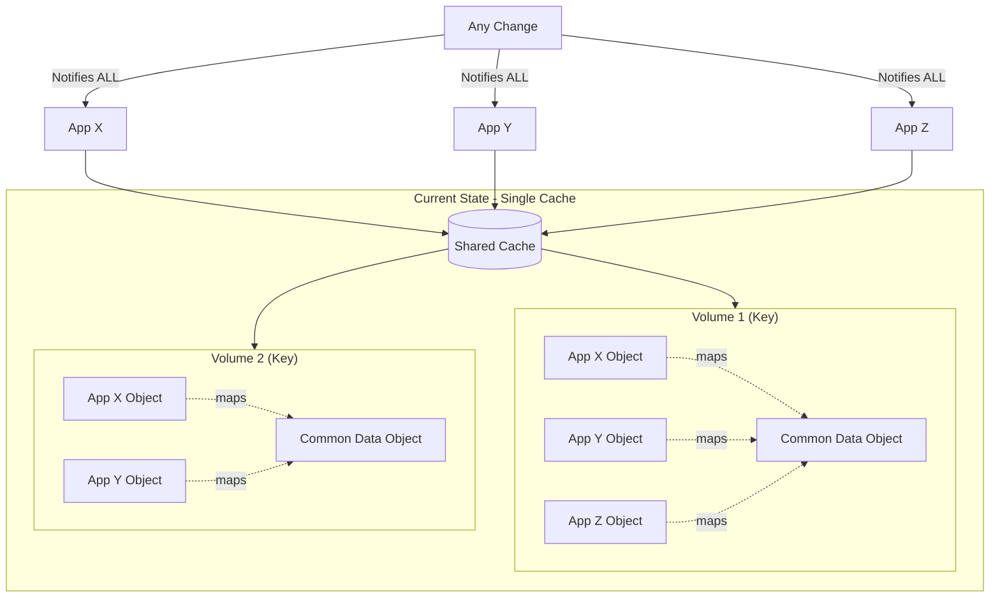

#### Why does this problem exist?

- Original design assumed all apps need all data
- No concept of "current presentation" or "volume focus"
- Single cache was simpler to implement initially
- Growth in apps and volumes wasn't anticipated

#### Who is affected?

| Stakeholder | How Affected | Priority |
|-------------|--------------|----------|
| Applications | Receive irrelevant notifications, process unnecessary updates | High |
| Users | Potential performance issues when many changes occur | Medium |
| System | Cache bloated with app-specific data, harder to scale | High |
| Developers | Complex to understand what's in cache, debugging harder | Medium |

#### What triggers this problem?

- Multiple apps open simultaneously
- Frequent volume changes across apps
- Apps working on different volumes concurrently
- High volume of data modifications

#### Impact of NOT Solving

| Category | Impact |
|----------|--------|
| Business | Slower app performance, poor user experience |
| Technical | Cache grows unbounded, notification storms, coupling between apps |
| User | Unnecessary UI refreshes, confusion about stale data |

### Success Criteria

#### Must Have (Non-negotiable)
- [ ] Each app has its own VolumeCache for app-specific objects
- [ ] CommonVolumeCache contains only shared/common data objects
- [ ] Apps only get notified about volumes they are currently presenting
- [ ] Write path: App update → VolumeCache → Convert → CommonVolumeCache
- [ ] Read path: Common change → Notify interested apps → Convert → VolumeCache
- [ ] No cyclic notifications (app that triggers change is not notified back)

#### Should Have (Important)
- [ ] Subscription manager knows exactly who is interested in which volumes
- [ ] Support for "in focus" (real-time) vs "not in focus" (background/on-switch) subscriptions
- [ ] Graceful handling of subscribe/unsubscribe race conditions
- [ ] Notification includes: volume ID, changed data, who triggered, change properties

#### Nice to Have (Bonus)
- [ ] Historical change tracking for debugging
- [ ] Metrics on subscription patterns
- [ ] Cache size optimization per app

#### Anti-Goals (NOT trying to achieve)
- Not trying to: Merge all apps into one unified data model
- Not trying to: Eliminate VolumeCaches entirely
- Not trying to: Support real-time sync for ALL volumes simultaneously

### Constraints

#### Technical
- Must use: Existing application architecture
- Must integrate with: Current cache infrastructure (to be migrated)
- Each app owns its converter (app-specific, not shared)
- Conversion is deterministic (same input → same output)

#### Business
- Timeline: [To be determined]
- Must maintain backward compatibility during migration

#### Compliance/Security
- Apps should only see their own VolumeCache data
- CommonVolumeCache access is controlled

---

## Part 2: Directions Explored 🧭

### Direction Overview

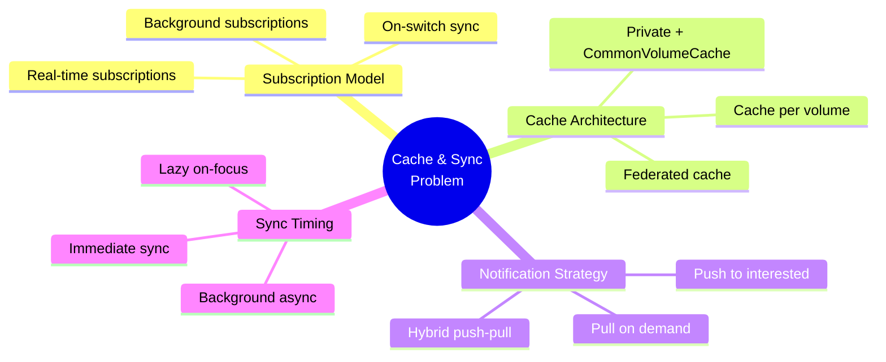

### Direction 1: Subscription-Based Push Model

**Concept:** CommonVolumeCache Manager maintains subscription lists per volume. On any change, push only to subscribed apps.

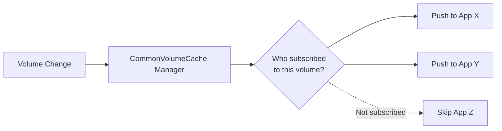

**Initial Thoughts:**
- ✅ Efficient - only interested parties are notified
- ✅ Real-time - immediate updates
- ⚠️ Requires subscription management infrastructure
- ⚠️ Race conditions on subscribe/unsubscribe

---

### Direction 2: Pull-Based On-Demand Sync

**Concept:** No push notifications. Apps pull fresh data when they switch focus to a volume.

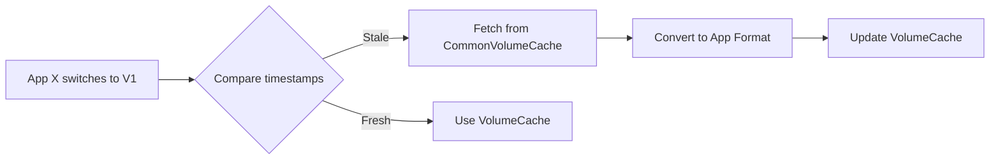

**Initial Thoughts:**
- ✅ Simple - no subscription management
- ✅ No race conditions
- ❌ Not real-time - changes only seen on focus switch
- ❌ App showing Volume 1 won't see changes until refocus

---

### Direction 3: Hybrid Push-Pull with Focus Levels

**Concept:** Two subscription levels - "In Focus" gets real-time push, "Not In Focus" pulls on switch.

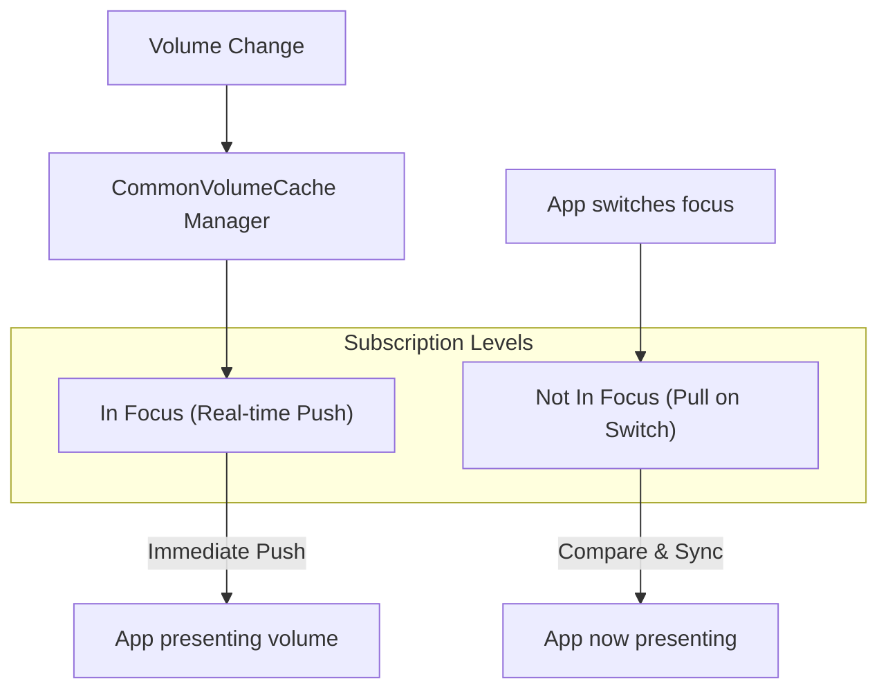

**Initial Thoughts:**
- ✅ Best of both worlds - real-time for active, lazy for inactive
- ✅ Reduces notification volume
- ⚠️ More complex subscription state management
- ⚠️ Two code paths (push vs pull)

---

## Part 3: Detailed Approaches 📊

### Approach 1: Full Subscription with Real-Time Push

**Direction:** Subscription-Based Push Model

**Description:**
Every app subscribes to volumes it's interested in. The CommonVolumeCache Manager maintains a registry of subscriptions. On any change to the CommonVolumeCache, the manager:
1. Identifies the changed volume
2. Looks up all subscribed apps (except the one that triggered the change)
3. Pushes change notification with full payload
4. Each app converts and updates its VolumeCache

**How It Works:**

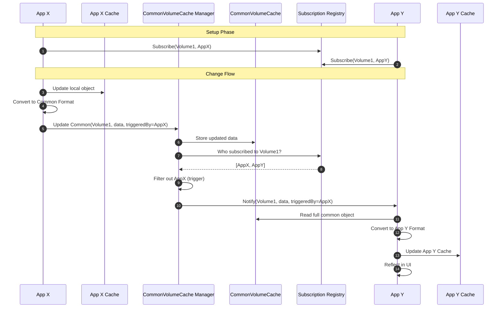

**Key Components:**

| Component | Responsibility | Technology Options |
|-----------|---------------|-------------------|
| CommonVolumeCache | Store shared data objects by Volume ID | In-memory / Redis |
| Subscription Registry | Track who is interested in which volumes | In-memory dictionary |
| CommonVolumeCache Manager | Orchestrate changes and notifications | Service class |
| Converters | App-specific conversion logic | Per-app implementation |
| VolumeCache | App-specific object storage | Local to each app |

#### Evaluation

**Pros ✅**

| Benefit | Impact | Confidence |
|---------|--------|------------|
| Real-time updates for all subscribed apps | High | High |
| Clean separation of concerns | High | High |
| Explicit subscription model - clear who gets what | Medium | High |
| Trigger filtering prevents cyclic updates | High | High |

**Cons ❌**

| Drawback | Impact | Mitigation |
|----------|--------|------------|
| Subscription management overhead | Medium | Keep registry simple, in-memory |
| Race conditions on subscribe/unsubscribe during change | Medium | Locking or queue-based processing |
| All subscribed apps process all changes for their volumes | Low | Payload includes enough info to short-circuit |

**Risks ⚠️**

| Risk | Likelihood | Impact | Mitigation |
|------|------------|--------|------------|
| Subscription registry becomes bottleneck | Low | High | Simple data structure, async notification |
| App fails to process notification | Medium | Medium | Dead letter queue, retry mechanism |
| Memory growth if many subscriptions | Low | Medium | Limit subscriptions per app |

**Complexity Assessment:**

| Dimension | Rating (1-5) | Notes |
|-----------|--------------|-------|
| Implementation effort | 3 | Registry + Manager + integration |
| Maintenance burden | 2 | Clear patterns, easy to reason about |
| Learning curve | 2 | Subscription model is familiar |
| Integration complexity | 3 | All apps need to adopt new pattern |
| Testing difficulty | 3 | Need to test subscription scenarios |
| **Total** | **13/25** | |

**Best Suited When:**
- Most subscribed apps need real-time updates
- Number of subscribers per volume is small
- Apps are always active/listening

**Avoid When:**
- Many apps subscribed but rarely care about changes
- High frequency of changes would flood notifications

---

### Approach 2: Two-Tier Subscription (Focus + Background)

**Direction:** Hybrid Push-Pull with Focus Levels

**Description:**
Two subscription levels:
1. **In Focus**: Real-time push notifications (synchronous)
2. **Not In Focus**: Background async notifications OR pull-on-switch

Apps explicitly declare their focus level per volume. The manager handles each differently.

**How It Works:**

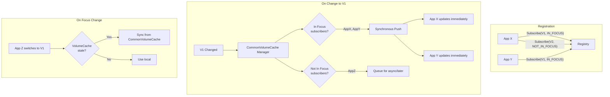

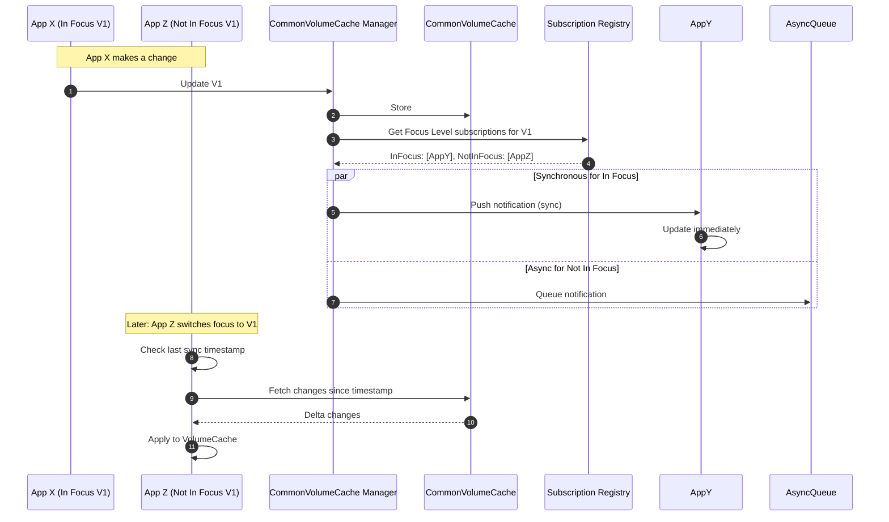

**Key Components:**

| Component | Responsibility | Technology Options |
|-----------|---------------|-------------------|
| Subscription Registry | Track subscriptions WITH focus level | In-memory + focus state |
| Focus Manager | Handle focus transitions, trigger sync | Per-app coordinator |
| Async Notification Queue | Buffer notifications for not-in-focus | Queue / background worker |
| Timestamp Tracker | Track last sync time per app per volume | Simple timestamp map |

#### Evaluation

**Pros ✅**

| Benefit | Impact | Confidence |
|---------|--------|------------|
| Real-time for active views, efficient for inactive | High | High |
| Reduces notification processing for background volumes | High | High |
| Apps control their own focus state | Medium | High |
| Graceful handling of many open volumes | High | Medium |

**Cons ❌**

| Drawback | Impact | Mitigation |
|----------|--------|------------|
| Two notification paths (sync + async) | Medium | Clear separation in code |
| Focus state management complexity | Medium | Simple state machine |
| Potential delay seeing changes on focus switch | Low | Pre-fetch if bandwidth allows |

**Risks ⚠️**

| Risk | Likelihood | Impact | Mitigation |
|------|------------|--------|------------|
| Inconsistency between focus levels | Medium | Medium | Clear contracts, testing |
| Focus switch race conditions | Medium | Low | Lock or queue transitions |
| Async queue backlog | Low | Medium | TTL on notifications, skip if too old |

**Complexity Assessment:**

| Dimension | Rating (1-5) | Notes |
|-----------|--------------|-------|
| Implementation effort | 4 | Two paths, focus management |
| Maintenance burden | 3 | More states to manage |
| Learning curve | 3 | New concept of focus levels |
| Integration complexity | 3 | Apps need focus awareness |
| Testing difficulty | 4 | Many combinations to test |
| **Total** | **17/25** | |

**Best Suited When:**
- Apps often have multiple volumes "open" but only one active
- Want to minimize processing for background volumes
- Can tolerate slight delay on focus switch

**Avoid When:**
- All volumes are equally important all the time
- Simple apps with single volume focus

---

### Approach 3: Pull-On-Switch with Timestamp Validation

**Direction:** Pull-Based On-Demand Sync

**Description:**
No push notifications at all. Each change to CommonVolumeCache updates a version/timestamp. When an app switches focus to a volume, it compares its VolumeCache timestamp with CommonVolumeCache and syncs if stale.

**How It Works:**

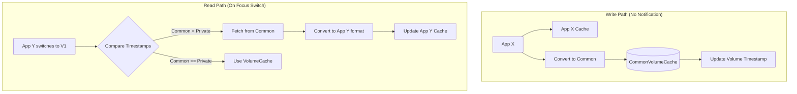

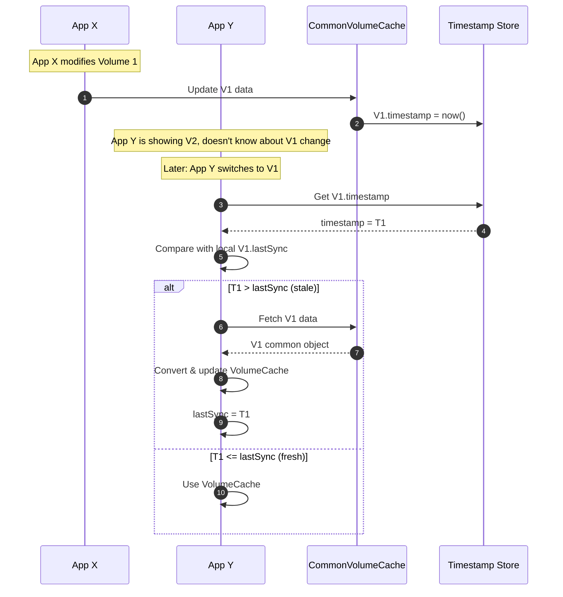

#### Evaluation

**Pros ✅**

| Benefit | Impact | Confidence |
|---------|--------|------------|
| Simplest implementation - no subscription infrastructure | High | High |
| No race conditions on subscribe/unsubscribe | High | High |
| Zero overhead when not switching focus | Medium | High |
| Apps fully control when they sync | Medium | Medium |

**Cons ❌**

| Drawback | Impact | Mitigation |
|----------|--------|------------|
| No real-time updates while viewing a volume | High | Must use Approach 1 or 2 for in-focus |
| Changes not seen until focus switch | High | Combine with periodic refresh |
| User might see stale data briefly on switch | Medium | Show loading indicator |

**Risks ⚠️**

| Risk | Likelihood | Impact | Mitigation |
|------|------------|--------|------------|
| User sees stale data for extended time | High | High | NOT suitable alone for active volumes |
| Timestamp comparison issues (clock skew) | Low | Medium | Use centralized version counter |

**Complexity Assessment:**

| Dimension | Rating (1-5) | Notes |
|-----------|--------------|-------|
| Implementation effort | 2 | Simple timestamp comparison |
| Maintenance burden | 1 | Very simple |
| Learning curve | 1 | Easy to understand |
| Integration complexity | 2 | Apps just check on switch |
| Testing difficulty | 2 | Straightforward scenarios |
| **Total** | **8/25** | |

**Best Suited When:**
- Combined with another approach for in-focus updates
- Background volumes only need eventual consistency
- Minimizing infrastructure is priority

**Avoid When:**
- Used alone - MUST combine with real-time for active volume
- Users expect to see changes without switching

---

### Approach 4: Event Sourcing with Selective Replay

**Direction:** Alternative Architecture

**Description:**
Instead of caching objects, store all changes as events. Each app replays relevant events to build its view. Subscriptions are event stream filters.

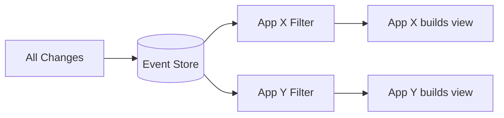

#### Evaluation

**Pros ✅**

| Benefit | Impact | Confidence |
|---------|--------|------------|
| Full audit trail | Medium | High |
| Flexible replay | Medium | Medium |
| Natural subscription via streams | Medium | Medium |

**Cons ❌**

| Drawback | Impact | Mitigation |
|----------|--------|------------|
| Major architectural change | High | Significant rewrite |
| Learning curve for team | High | Training needed |
| Complexity for simple use case | High | Over-engineering risk |

**Complexity Assessment:**

| Dimension | Rating (1-5) | Notes |
|-----------|--------------|-------|
| Implementation effort | 5 | Major rewrite |
| Maintenance burden | 4 | New paradigm |
| Learning curve | 5 | Event sourcing expertise needed |
| Integration complexity | 5 | All apps must change |
| Testing difficulty | 4 | Event replay testing |
| **Total** | **23/25** | |

**Best Suited When:**
- Starting from scratch
- Need full audit trail
- Team has event sourcing experience

**Avoid When:**
- Existing system needs incremental improvement
- Team unfamiliar with event sourcing
- **This case** - too much change for the problem

---

## Part 4: Decision 🏆

### Comparison Matrix

| Criteria | Weight | Approach 1<br>(Full Push) | Approach 2<br>(Two-Tier) | Approach 3<br>(Pull) | Approach 4<br>(Events) |
|----------|--------|---------------------------|--------------------------|----------------------|------------------------|
| Meets must-have criteria | 5 | ✅ | ✅ | ❌* | ✅ |
| Real-time for active volume | 4 | 10 | 10 | 2 | 8 |
| Simplicity | 3 | 7 | 5 | 10 | 2 |
| Efficiency (notification volume) | 3 | 6 | 9 | 10 | 7 |
| Maintainability | 3 | 8 | 6 | 9 | 4 |
| Migration effort | 2 | 7 | 6 | 8 | 2 |
| Team familiarity | 2 | 8 | 7 | 9 | 3 |
| **Weighted Score** | | **159** | **155** | **126*** | **103** |

> *Approach 3 alone fails must-have "real-time for presenting volume" - would need hybrid  
> ❌ = Eliminated

### Recommendation

#### Chosen Approach: Approach 2 - Two-Tier Subscription (Focus + Background)

With elements from Approach 3 for the "Not In Focus" tier.

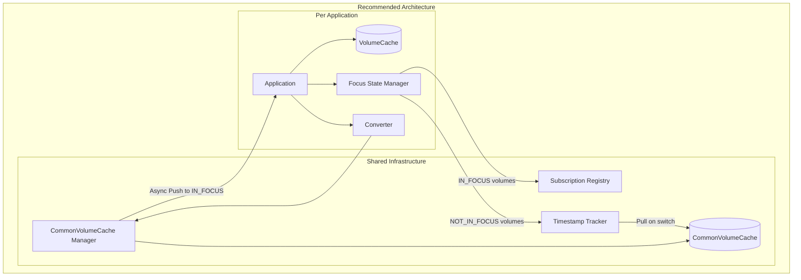

#### Execution Model (ADR-0001)

> See full details: [ADR-0001: Async Notification Execution Model](adr/0001-async-notification-execution-model.md)

**Key Decision:** Use **async fire-and-forget** for In Focus notifications to prevent one app from blocking others.

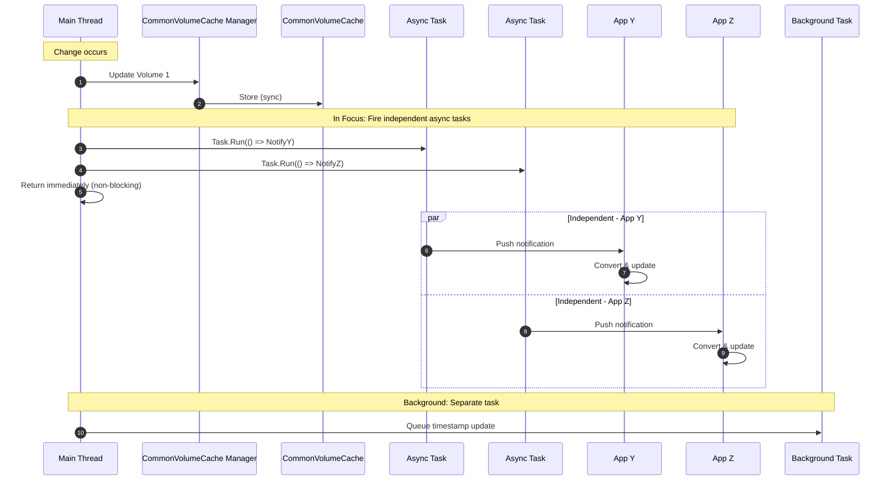

| Tier | Execution | Behavior |
|------|-----------|----------|
| **In Focus** | Main thread fires async tasks | Each app notified independently, non-blocking |
| **Not In Focus** | Separate background task | Records timestamp; app pulls on switch |
| **On Switch** | App-initiated | Pull changes since lastSync + update registration |

**Why Async Fire-and-Forget?**
- One slow/blocked app does NOT delay others
- Triggering app returns immediately
- Each notification is independent
- Failures are isolated and logged

**On Focus Switch Flow:**
```
App switches from V1 to V2
    ├─► Unsubscribe from V1 (IN_FOCUS)
    ├─► Subscribe to V2 (IN_FOCUS)
    ├─► Check: any changes to V2 since lastSync?
    │       └─► If yes: Pull, Convert, Update VolumeCache
    └─► Present V2 to user
```

**Hybrid Design:**
- **In Focus volumes**: Async fire-and-forget push - immediate but non-blocking
- **Not In Focus volumes**: Use Approach 3's pull model - sync on focus switch using timestamps

#### Why This Over Others

| Rejected Approach | Primary Reason for Rejection |
|-------------------|------------------------------|
| Approach 1 (Full Push) | Inefficient for apps with many open volumes - would notify even when not needed |
| Approach 3 (Pull Only) | Cannot meet requirement of real-time updates for presenting volume |
| Approach 4 (Events) | Over-engineering - major architectural change not justified |

#### Key Factors in Decision
1. **Real-time requirement**: Must have immediate updates for the volume user is viewing
2. **Efficiency**: Don't want to process notifications for volumes not currently presented
3. **Pragmatic complexity**: Two-tier is more complex than full push, but more efficient
4. **Migration path**: Can implement incrementally - start with push, add pull-on-switch later

#### Risks We're Accepting

| Risk | Why We Accept It | How We'll Monitor |
|------|------------------|-------------------|
| Two code paths increases complexity | Provides best UX/efficiency tradeoff | Keep clear separation, good tests |
| Focus state management bugs | Bounded complexity, state machine helps | Unit tests, state transition logging |
| Slight delay on focus switch | Users expect loading on switch anyway | Keep sync fast, show loading state |

#### Assumptions We're Making

- [ ] Apps can reliably track their own focus state - **Validation:** Review with app teams
- [ ] Subscription registry can be in-memory (no persistence needed) - **Validation:** Check deployment model
- [ ] Conversion is fast enough for real-time path - **Validation:** Benchmark existing converters
- [ ] Most apps have 1-2 volumes in focus at a time - **Validation:** Analyze current usage

### POC Scope

**Goal:** Validate the two-tier subscription model works with existing apps

**Scope:**
- Implement for 2 apps (X and Y) with 3 test volumes
- Include: Subscription registry, focus state manager, push path, pull-on-switch path
- Exclude: Migration of all apps, performance optimization, monitoring

**Success Criteria:**
- [ ] In Focus updates arrive within 100ms
- [ ] Not In Focus sync completes within 500ms on switch
- [ ] No cyclic notifications observed
- [ ] Race conditions handled gracefully

**Timeline:** 2-3 weeks

---

## Approval

- [x] Team reviewed all approaches
- [x] Stakeholders agree with direction
- [x] Risks acknowledged and accepted
- [x] Ready to proceed to Requirements phase

**Approved by:** Team
**Date:** 2026-03-22

---

## Appendix: Discussion Notes

### Session 1 - 2026-03-22

**Problem Clarification:**
- Single cache today with Volume ID as key
- Each app stores: Common Data Object + App-specific objects (mapped to common)
- New design: VolumeCache per app + CommonVolumeCache for shared data
- Write: App → VolumeCache → Convert → CommonVolumeCache
- Read: Common change → Notify interested → Convert → VolumeCache

**Subscription Model:**
- CommonVolumeCache Manager knows who is subscribed to what
- On presentation change, app subscribes/unsubscribes
- Must filter out triggering app to avoid cyclic updates

**Answers to Clarifying Questions:**
1. Conversion: Deterministic, each app owns its converter, failure = no data
2. Consistency: Immediate invocation for interested parties
3. Cache invalidation: Two options discussed:
   - Background async for not-in-focus
   - Pull on focus switch with timestamp comparison
4. Volume presentation: Can subscribe to multiple volumes
5. Notification: Includes volume, data, who triggered, change properties
