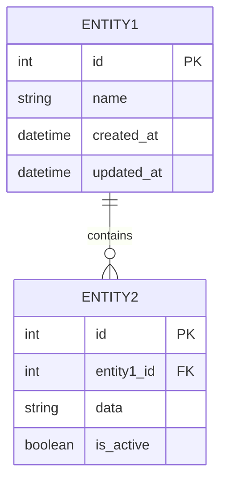
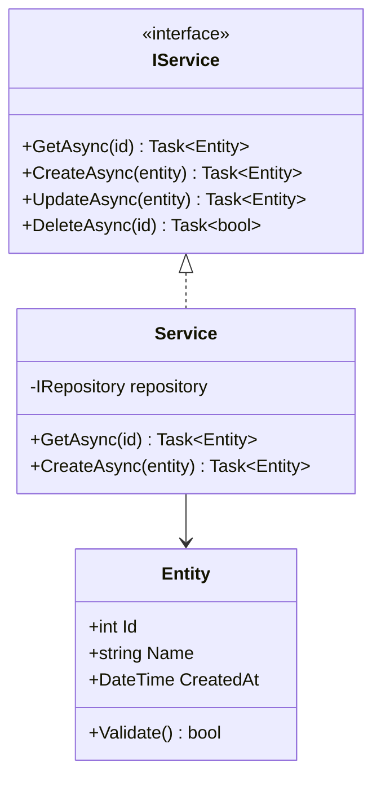
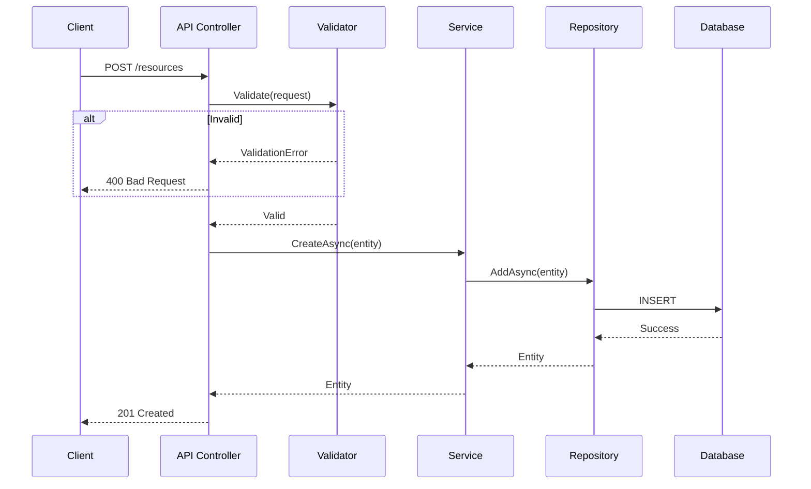
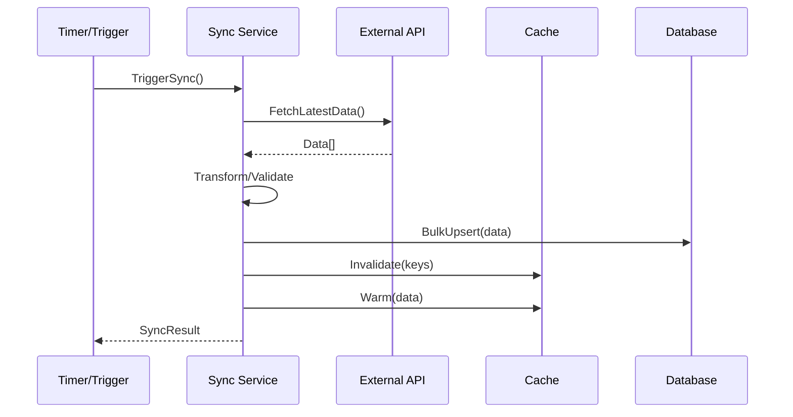

# Detailed Design Document

## Domain Model

### Entity Relationship Diagram



### Class Diagram



---

## Entities

### Entity Name
| Property | Type | Required | Description | Validation |
|----------|------|----------|-------------|------------|
| Id | int | Yes | Primary key | Auto-generated |
| Name | string | Yes | Display name | 1-100 chars |
| CreatedAt | DateTime | Yes | Creation timestamp | Auto-set |
| UpdatedAt | DateTime | No | Last update | Auto-set on update |

**Business Rules:**
1. Rule 1
2. Rule 2

---

## API Design

### Base URL
`/api/v1`

### Authentication
[Describe authentication method]

### Endpoints

#### GET /resources
**Description**: List all resources

**Query Parameters:**
| Name | Type | Required | Description |
|------|------|----------|-------------|
| page | int | No | Page number (default: 1) |
| limit | int | No | Items per page (default: 20) |

**Response (200):**
```json
{
  "data": [
    {
      "id": 1,
      "name": "Resource 1"
    }
  ],
  "pagination": {
    "page": 1,
    "limit": 20,
    "total": 100
  }
}
```

#### GET /resources/{id}
**Description**: Get a single resource

**Path Parameters:**
| Name | Type | Description |
|------|------|-------------|
| id | int | Resource ID |

**Response (200):**
```json
{
  "id": 1,
  "name": "Resource 1",
  "createdAt": "2024-01-01T00:00:00Z"
}
```

**Errors:**
| Code | Description |
|------|-------------|
| 404 | Resource not found |

#### POST /resources
**Description**: Create a new resource

**Request Body:**
```json
{
  "name": "string"
}
```

**Response (201):**
```json
{
  "id": 1,
  "name": "string",
  "createdAt": "2024-01-01T00:00:00Z"
}
```

**Errors:**
| Code | Description |
|------|-------------|
| 400 | Invalid request body |
| 409 | Resource already exists |

#### PUT /resources/{id}
**Description**: Update a resource

**Request Body:**
```json
{
  "name": "string"
}
```

**Response (200):**
```json
{
  "id": 1,
  "name": "string",
  "updatedAt": "2024-01-01T00:00:00Z"
}
```

#### DELETE /resources/{id}
**Description**: Delete a resource

**Response (204):** No content

---

## Sequence Diagrams

### Use Case: Create Resource



### Use Case: Sync Data



---

## Data Model

### Database Schema

```sql
-- Resources table
CREATE TABLE resources (
    id INT PRIMARY KEY IDENTITY(1,1),
    name NVARCHAR(100) NOT NULL,
    created_at DATETIME2 NOT NULL DEFAULT GETUTCDATE(),
    updated_at DATETIME2 NULL,
    is_deleted BIT NOT NULL DEFAULT 0,
    CONSTRAINT UQ_resources_name UNIQUE (name)
);

-- Index for common queries
CREATE INDEX IX_resources_name ON resources(name) WHERE is_deleted = 0;
CREATE INDEX IX_resources_created ON resources(created_at DESC);
```

---

## Error Handling

### Error Response Format
```json
{
  "error": {
    "code": "ERROR_CODE",
    "message": "Human readable message",
    "details": [
      {
        "field": "name",
        "message": "Name is required"
      }
    ],
    "traceId": "abc123"
  }
}
```

### Error Codes
| Code | HTTP Status | Description |
|------|-------------|-------------|
| VALIDATION_ERROR | 400 | Request validation failed |
| NOT_FOUND | 404 | Resource not found |
| CONFLICT | 409 | Resource already exists |
| INTERNAL_ERROR | 500 | Unexpected server error |

---

## Sign-off

| Role | Name | Date | Signature |
|------|------|------|-----------|
| Designer | | | |
| Tech Lead | | | |
| Architect | | | |
