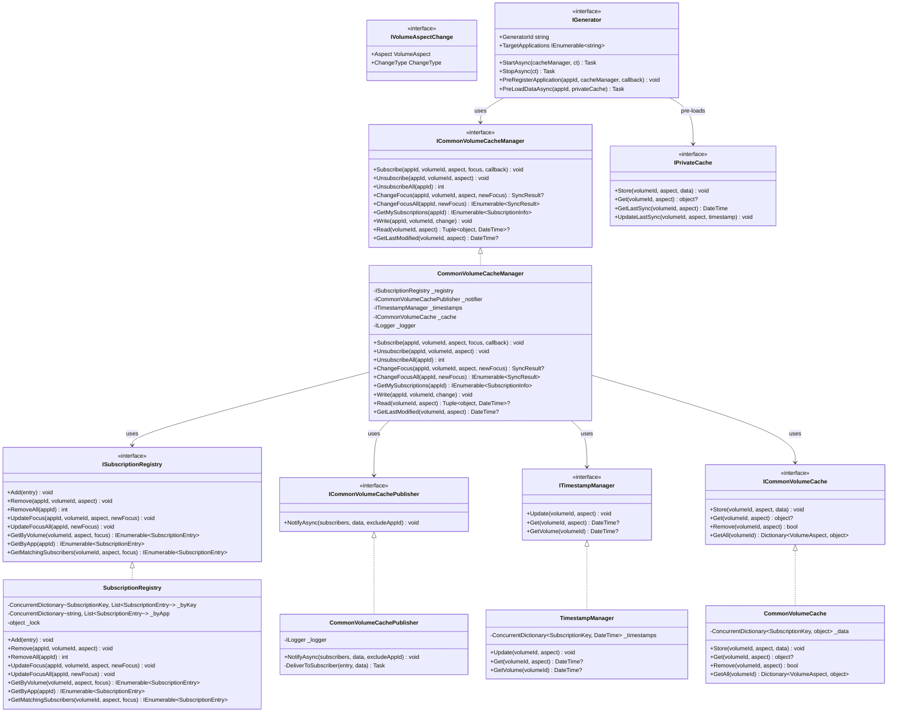
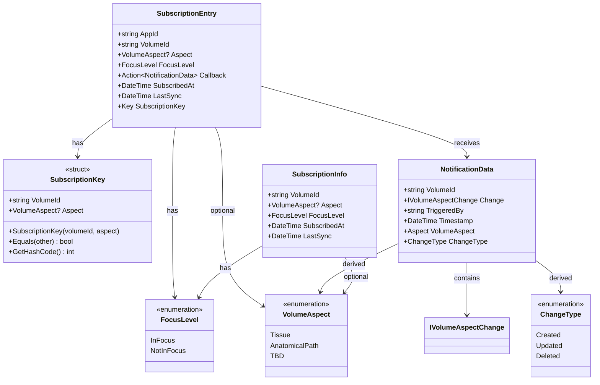
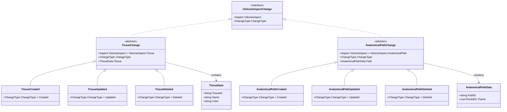
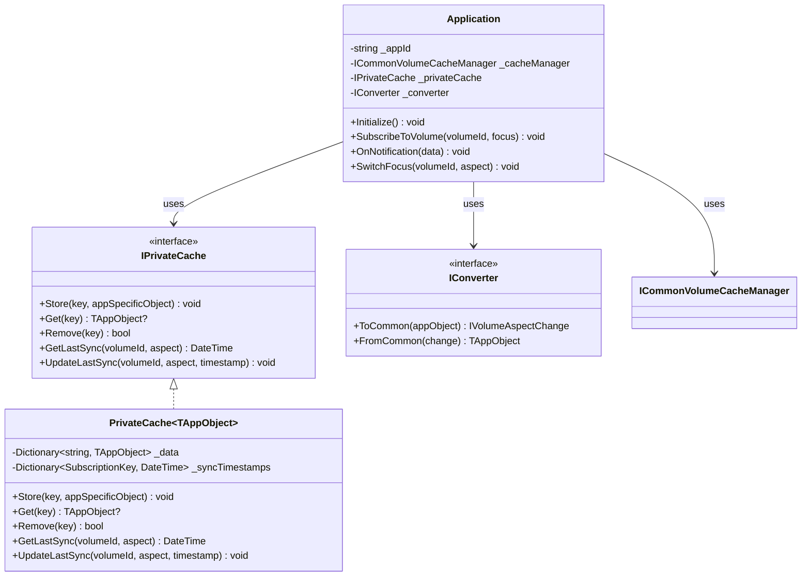
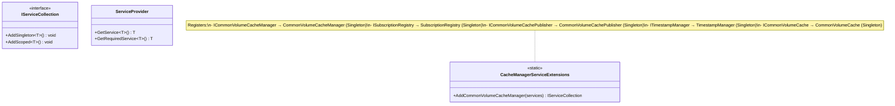

# Class Diagrams: Distribution Data Cache and Sync Framework

**Date:** 2026-03-23
**Version:** 1.2
**Architecture Reference:** [architecture.md](../architecture.md)
**Requirements Reference:** [requirements.md](../requirements.md)

---

## Overview

This document contains detailed class diagrams for all framework components.

---

## Complete Class Diagram

---

## Data Structures Class Diagram

---

## Change Classes Hierarchy

---

## Application-Side Architecture

---

## Dependency Injection Structure

---

## Revision History

| Version | Date | Author | Changes |
|---------|------|--------|---------|
| 1.0 | 2026-03-23 | | Initial class diagrams |
| 1.1 | 2026-03-23 | | Added UnsubscribeAll, RemoveAll, ChangeFocusAll, UpdateFocusAll methods || 1.2 | 2026-03-23 | | Added IGenerator, IPrivateCache interfaces |