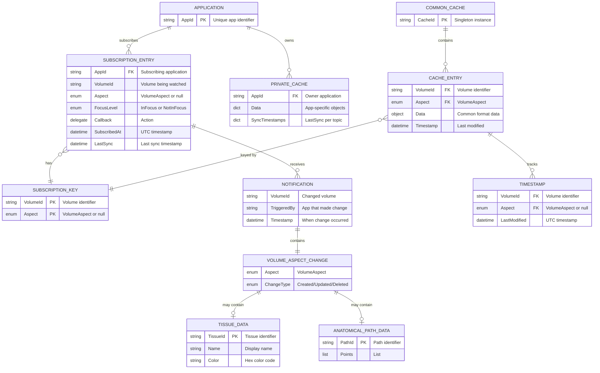
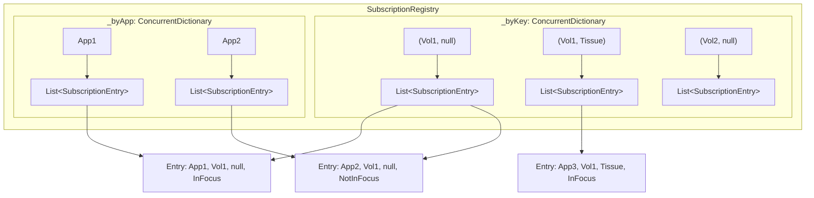
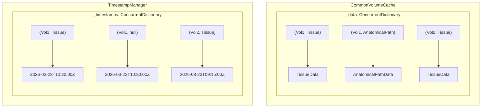
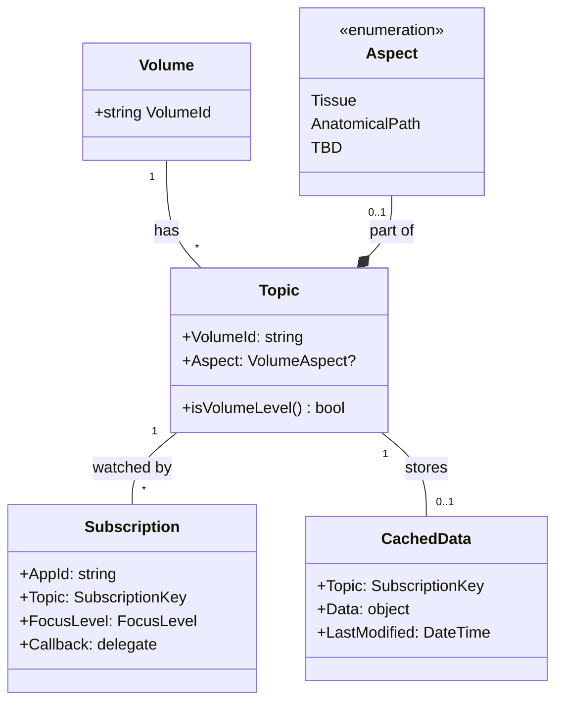

# Data Model: Distribution Data Cache and Sync Framework

**Date:** 2026-03-23
**Version:** 1.0
**Architecture Reference:** [architecture.md](../architecture.md)

---

## Overview

This document describes the data model for the in-memory cache and subscription system.

---

## 1. Entity Relationship Diagram



---

## 2. In-Memory Data Structures

### 2.1 Subscription Registry Storage



### 2.2 CommonVolumeCache Storage



---

## 3. Data Structure Properties

### 3.1 Subscription Entry

| Property | Type | Nullable | Description | Index |
|----------|------|----------|-------------|-------|
| AppId | `string` | No | Unique application identifier | `_byApp` key |
| VolumeId | `string` | No | Volume being watched | Part of `_byKey` |
| Aspect | `VolumeAspect?` | Yes | Specific aspect or null for all | Part of `_byKey` |
| FocusLevel | `FocusLevel` | No | InFocus or NotInFocus | Filter criteria |
| Callback | `Action<NotificationData>` | No | Notification handler | N/A |
| SubscribedAt | `DateTime` | No | When subscription was created | Informational |
| LastSync | `DateTime` | No | Last successful sync timestamp | Sync comparison |

### 3.2 Cache Entry

| Property | Type | Nullable | Description |
|----------|------|----------|-------------|
| VolumeId | `string` | No | Volume identifier |
| Aspect | `VolumeAspect` | No | Always specified for cache entries |
| Data | `object` | No | The actual data (TissueData, etc.) |

### 3.3 Timestamp Entry

| Property | Type | Nullable | Description |
|----------|------|----------|-------------|
| VolumeId | `string` | No | Volume identifier |
| Aspect | `VolumeAspect?` | Yes | null = volume-level timestamp |
| LastModified | `DateTime` | No | UTC timestamp of last change |

---

## 4. Key Relationships

### 4.1 Subscription Key Composition

```
SubscriptionKey = (VolumeId: string, Aspect: VolumeAspect?)

Examples:
- ("Volume1", null)           → All aspects of Volume1
- ("Volume1", Tissue)         → Only Tissue aspect
- ("Volume1", AnatomicalPath) → Only AnatomicalPath aspect
```

### 4.2 Hierarchical Subscription Matching

```
When write occurs to (Volume1, Tissue):

Matching Keys:
├── (Volume1, Tissue)    → Direct match
└── (Volume1, null)      → Volume-level (wildcard)

Non-Matching Keys:
└── (Volume1, AnatomicalPath) → Different aspect
```

### 4.3 Timestamp Propagation

```
Write to (Volume1, Tissue):
├── Update timestamp[(Volume1, Tissue)] = now
└── Update timestamp[(Volume1, null)]   = now  ← Parent also updated

This ensures:
- Volume-level subscriber sees: "Volume1 changed"
- Aspect-level subscriber sees: "Volume1:Tissue changed"
```

---

## 5. Data Cardinalities

| Relationship | Cardinality | Description |
|--------------|-------------|-------------|
| Application → Subscriptions | 1:N | App can have many subscriptions |
| Subscription → Key | N:1 | Many apps subscribe to same topic |
| Application → VolumeCache | 1:1 | One VolumeCache per app |
| CommonVolumeCache → Entries | 1:N | Single cache, many entries |
| Cache Entry → Timestamp | 1:1 | Each entry has one timestamp |
| Notification → Change | 1:1 | Each notification has one change |

---

## 6. Domain Model Summary



---

## 7. Concurrency Considerations

### 7.1 Data Structure Concurrency

| Structure | Type | Lock Strategy |
|-----------|------|---------------|
| `_byKey` | `ConcurrentDictionary<K, List<T>>` | Lock on specific List |
| `_byApp` | `ConcurrentDictionary<K, List<T>>` | Lock on specific List |
| `_data` | `ConcurrentDictionary<K, object>` | Built-in thread safety |
| `_timestamps` | `ConcurrentDictionary<K, DateTime>` | Built-in thread safety |

### 7.2 Atomic Operations

| Operation | Atomicity | Implementation |
|-----------|-----------|----------------|
| Subscribe | Atomic per entry | Lock on list |
| Unsubscribe | Atomic per entry | Lock on list |
| ChangeFocus | Atomic | Lock on entry |
| Write | Atomic per key | ConcurrentDictionary |
| Read | Thread-safe | ConcurrentDictionary |

---

## 8. Memory Layout Estimation

### 8.1 Per Subscription Entry

```
SubscriptionEntry:
├── AppId (string)           ~24-50 bytes
├── VolumeId (string)        ~24-50 bytes
├── Aspect (enum)            4 bytes
├── FocusLevel (enum)        4 bytes
├── Callback (delegate)      ~24 bytes (reference)
├── SubscribedAt (DateTime)  8 bytes
├── LastSync (DateTime)      8 bytes
└── Object overhead          ~24 bytes
─────────────────────────────────────────
Total: ~150-200 bytes per subscription
```

### 8.2 Capacity Estimates

| Scenario | Apps | Subscriptions/App | Total Subscriptions | Memory |
|----------|------|-------------------|---------------------|--------|
| Small | 5 | 10 | 50 | ~10 KB |
| Medium | 20 | 50 | 1,000 | ~200 KB |
| Large | 50 | 100 | 5,000 | ~1 MB |

---

## Revision History

| Version | Date | Author | Changes |
|---------|------|--------|---------|
| 1.0 | 2026-03-23 | | Initial data model |
