# Sequence Diagrams: Distribution Data Cache and Sync Framework

**Date:** 2026-03-23
**Version:** 1.2
**Architecture Reference:** [architecture.md](../architecture.md)
**Requirements Reference:** [requirements.md](../requirements.md)

---

## Overview

This document contains detailed sequence diagrams for all key flows in the framework:

1. **Subscribe Flow** - Registration for notifications
2. **Unsubscribe Flow** - Removing subscriptions
3. **Write Flow** - Writing data and triggering notifications
4. **Focus Switch Flow** - Pull-on-switch mechanism
5. **Multi-Aspect Notification Flow** - Hierarchical matching
6. **Error Handling Flows** - Failure scenarios
7. **Generator Pre-Loading Flow** - Background data preparation for unloaded apps
8. **Application Lifecycle Flow** - Startup, shutdown, focus changes

---

## 1. Subscribe Flow

### 1.1 Subscribe to Volume (All Aspects)

**Requirements:** US-006 (AC-006.1 to AC-006.5)

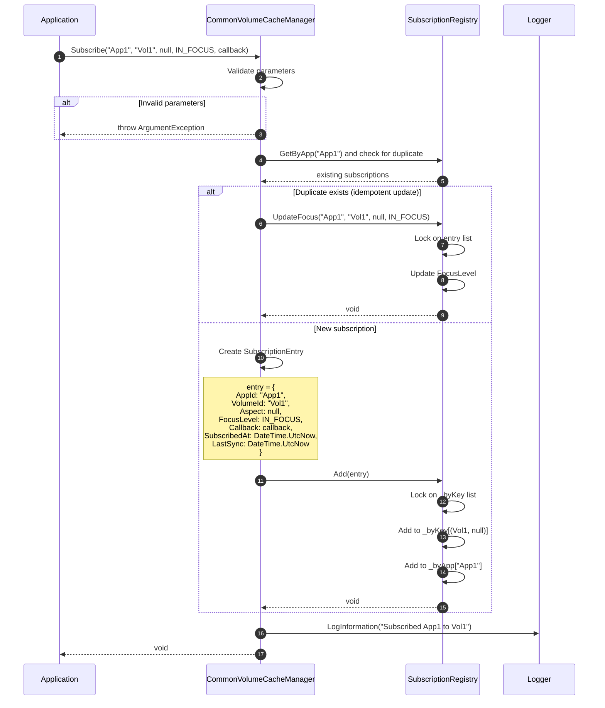
```mermaid
sequenceDiagram
    autonumber
    participant App as Application
    participant CCM as CommonVolumeCacheManager
    participant Reg as SubscriptionRegistry
    participant Log as Logger
    
    App->>CCM: Subscribe("App1", "Vol1", null, IN_FOCUS, callback)
    
    CCM->>CCM: Validate parameters
    alt Invalid parameters
        CCM-->>App: throw ArgumentException
    end
    
    CCM->>Reg: GetByApp("App1") and check for duplicate
    Reg-->>CCM: existing subscriptions
    
    alt Duplicate exists (idempotent update)
        CCM->>Reg: UpdateFocus("App1", "Vol1", null, IN_FOCUS)
        Reg->>Reg: Lock on entry list
        Reg->>Reg: Update FocusLevel
        Reg-->>CCM: void
    else New subscription
        CCM->>CCM: Create SubscriptionEntry
        Note over CCM: entry = {<br/>AppId: "App1",<br/>VolumeId: "Vol1",<br/>Aspect: null,<br/>FocusLevel: IN_FOCUS,<br/>Callback: callback,<br/>SubscribedAt: DateTime.UtcNow,<br/>LastSync: DateTime.UtcNow<br/>}
        CCM->>Reg: Add(entry)
        Reg->>Reg: Lock on _byKey list
        Reg->>Reg: Add to _byKey[(Vol1, null)]
        Reg->>Reg: Add to _byApp["App1"]
        Reg-->>CCM: void
    end
    
    CCM->>Log: LogInformation("Subscribed App1 to Vol1")
    CCM-->>App: void
```

### 1.2 Subscribe to Volume Aspect

**Requirements:** US-006 (AC-006.1)

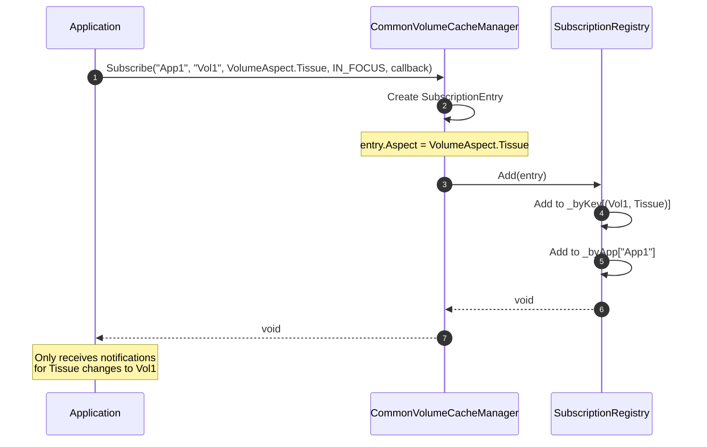
```mermaid
sequenceDiagram
    autonumber
    participant App as Application
    participant CCM as CommonVolumeCacheManager
    participant Reg as SubscriptionRegistry
    
    App->>CCM: Subscribe("App1", "Vol1", VolumeAspect.Tissue, IN_FOCUS, callback)
    
    CCM->>CCM: Create SubscriptionEntry
    Note over CCM: entry.Aspect = VolumeAspect.Tissue
    
    CCM->>Reg: Add(entry)
    Reg->>Reg: Add to _byKey[(Vol1, Tissue)]
    Reg->>Reg: Add to _byApp["App1"]
    Reg-->>CCM: void
    
    CCM-->>App: void
    
    Note over App: Only receives notifications<br/>for Tissue changes to Vol1
```

---

## 2. Unsubscribe Flow

**Requirements:** US-008 (AC-008.1 to AC-008.5)

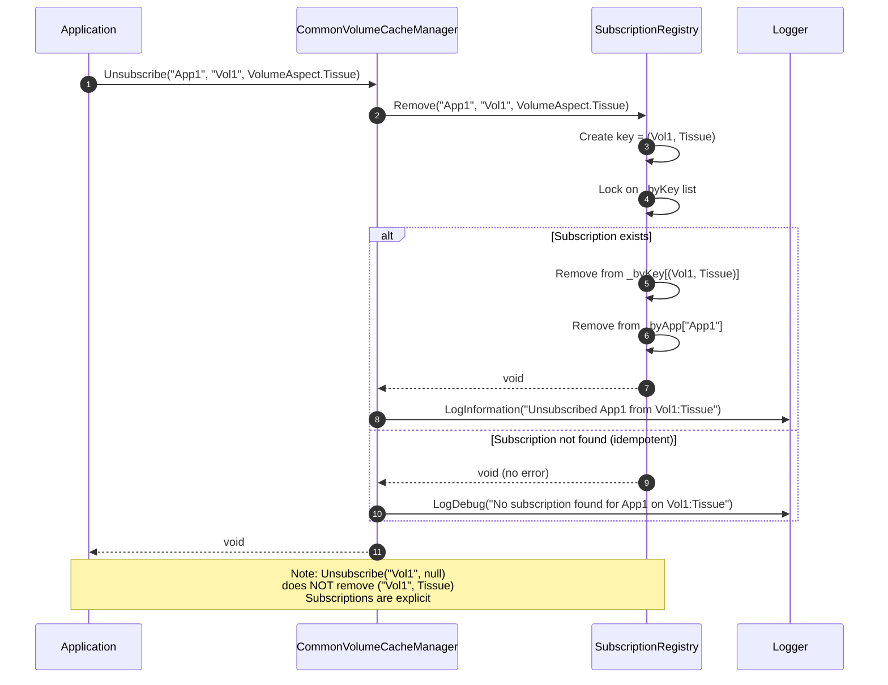
```mermaid
sequenceDiagram
    autonumber
    participant App as Application
    participant CCM as CommonVolumeCacheManager
    participant Reg as SubscriptionRegistry
    participant Log as Logger
    
    App->>CCM: Unsubscribe("App1", "Vol1", VolumeAspect.Tissue)
    
    CCM->>Reg: Remove("App1", "Vol1", VolumeAspect.Tissue)
    
    Reg->>Reg: Create key = (Vol1, Tissue)
    Reg->>Reg: Lock on _byKey list
    
    alt Subscription exists
        Reg->>Reg: Remove from _byKey[(Vol1, Tissue)]
        Reg->>Reg: Remove from _byApp["App1"]
        Reg-->>CCM: void
        CCM->>Log: LogInformation("Unsubscribed App1 from Vol1:Tissue")
    else Subscription not found (idempotent)
        Reg-->>CCM: void (no error)
        CCM->>Log: LogDebug("No subscription found for App1 on Vol1:Tissue")
    end
    
    CCM-->>App: void
    
    Note over App,Reg: Note: Unsubscribe("Vol1", null)<br/>does NOT remove ("Vol1", Tissue)<br/>Subscriptions are explicit
```

---

## 3. Write Flow with Notifications

**Requirements:** US-005, US-010, US-011, US-012

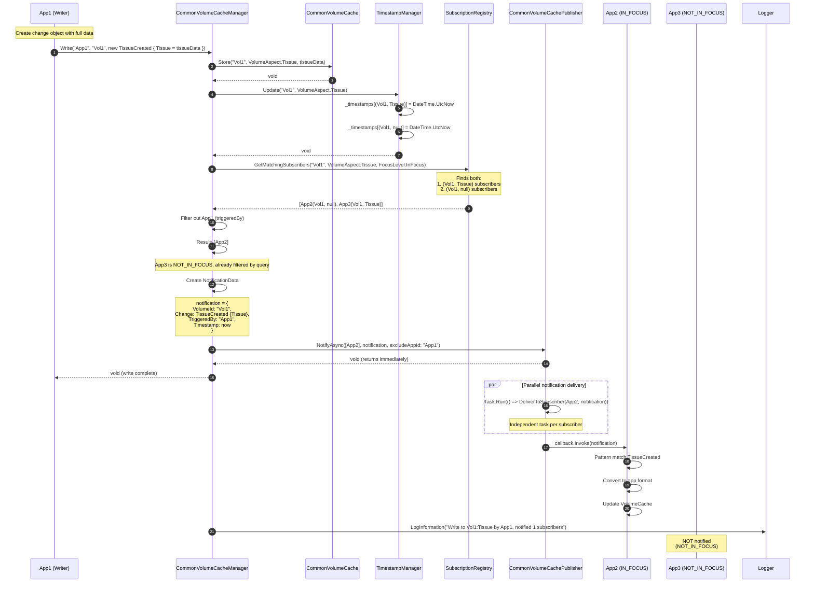
```mermaid
sequenceDiagram
    autonumber
    participant App1 as App1 (Writer)
    participant CCM as CommonVolumeCacheManager
    participant Cache as CommonVolumeCache
    participant TS as TimestampManager
    participant Reg as SubscriptionRegistry
    participant NS as CommonVolumeCachePublisher
    participant App2 as App2 (IN_FOCUS)
    participant App3 as App3 (NOT_IN_FOCUS)
    participant Log as Logger
    
    Note over App1: Create change object with full data
    App1->>CCM: Write("App1", "Vol1", new TissueCreated { Tissue = tissueData })
    
    %% Store in cache
    CCM->>Cache: Store("Vol1", VolumeAspect.Tissue, tissueData)
    Cache-->>CCM: void
    
    %% Update timestamps (both aspect and volume level)
    CCM->>TS: Update("Vol1", VolumeAspect.Tissue)
    TS->>TS: _timestamps[(Vol1, Tissue)] = DateTime.UtcNow
    TS->>TS: _timestamps[(Vol1, null)] = DateTime.UtcNow
    TS-->>CCM: void
    
    %% Find matching subscribers
    CCM->>Reg: GetMatchingSubscribers("Vol1", VolumeAspect.Tissue, FocusLevel.InFocus)
    Note over Reg: Finds both:<br/>1. (Vol1, Tissue) subscribers<br/>2. (Vol1, null) subscribers
    Reg-->>CCM: [App2(Vol1, null), App3(Vol1, Tissue)]
    
    %% Filter out self and NOT_IN_FOCUS
    CCM->>CCM: Filter out App1 (triggeredBy)
    CCM->>CCM: Result: [App2]
    Note over CCM: App3 is NOT_IN_FOCUS, already filtered by query
    
    %% Create notification data
    CCM->>CCM: Create NotificationData
    Note over CCM: notification = {<br/>VolumeId: "Vol1",<br/>Change: TissueCreated {Tissue},<br/>TriggeredBy: "App1",<br/>Timestamp: now<br/>}
    
    %% Async notification
    CCM->>NS: NotifyAsync([App2], notification, excludeAppId: "App1")
    NS-->>CCM: void (returns immediately)
    
    CCM-->>App1: void (write complete)
    
    %% Async delivery (fire-and-forget)
    par Parallel notification delivery
        NS->>NS: Task.Run(() => DeliverToSubscriber(App2, notification))
        Note over NS: Independent task per subscriber
    end
    
    NS->>App2: callback.Invoke(notification)
    
    App2->>App2: Pattern match TissueCreated
    App2->>App2: Convert to app format
    App2->>App2: Update VolumeCache
    
    CCM->>Log: LogInformation("Write to Vol1:Tissue by App1, notified 1 subscribers")
    
    Note over App3: NOT notified<br/>(NOT_IN_FOCUS)
```

---

## 4. Focus Switch Flow (Pull on Switch)

**Requirements:** US-009, US-013, US-014

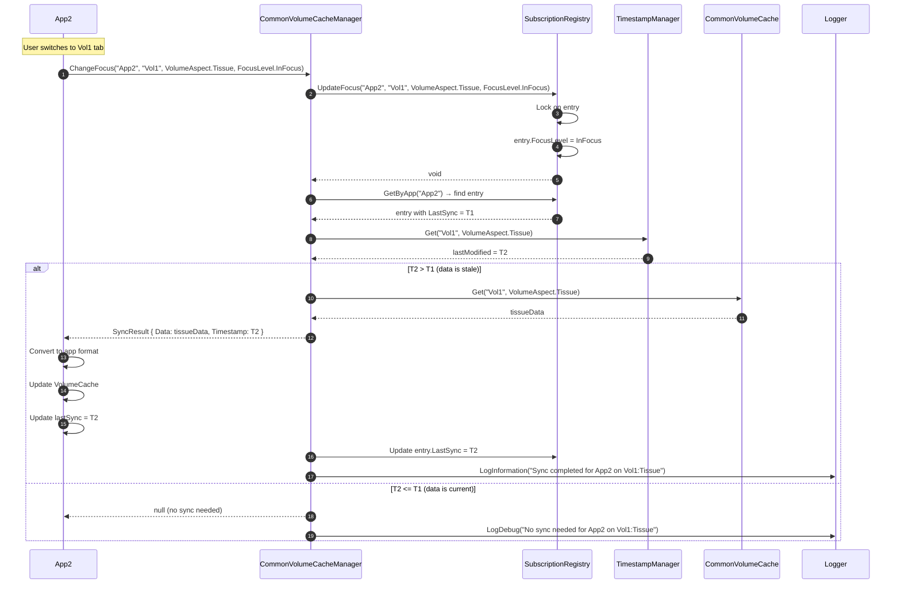
```mermaid
sequenceDiagram
    autonumber
    participant App2 as App2
    participant CCM as CommonVolumeCacheManager
    participant Reg as SubscriptionRegistry
    participant TS as TimestampManager
    participant Cache as CommonVolumeCache
    participant Log as Logger
    
    Note over App2: User switches to Vol1 tab
    App2->>CCM: ChangeFocus("App2", "Vol1", VolumeAspect.Tissue, FocusLevel.InFocus)
    
    %% Update focus level in registry
    CCM->>Reg: UpdateFocus("App2", "Vol1", VolumeAspect.Tissue, FocusLevel.InFocus)
    Reg->>Reg: Lock on entry
    Reg->>Reg: entry.FocusLevel = InFocus
    Reg-->>CCM: void
    
    %% Check if sync needed
    CCM->>Reg: GetByApp("App2") → find entry
    Reg-->>CCM: entry with LastSync = T1
    
    CCM->>TS: Get("Vol1", VolumeAspect.Tissue)
    TS-->>CCM: lastModified = T2
    
    alt T2 > T1 (data is stale)
        CCM->>Cache: Get("Vol1", VolumeAspect.Tissue)
        Cache-->>CCM: tissueData
        
        CCM-->>App2: SyncResult { Data: tissueData, Timestamp: T2 }
        
        App2->>App2: Convert to app format
        App2->>App2: Update VolumeCache
        App2->>App2: Update lastSync = T2
        
        CCM->>Reg: Update entry.LastSync = T2
        
        CCM->>Log: LogInformation("Sync completed for App2 on Vol1:Tissue")
    else T2 <= T1 (data is current)
        CCM-->>App2: null (no sync needed)
        CCM->>Log: LogDebug("No sync needed for App2 on Vol1:Tissue")
    end
```

---

## 5. Multi-Aspect Notification Flow

**Requirements:** US-015 (hierarchical matching)

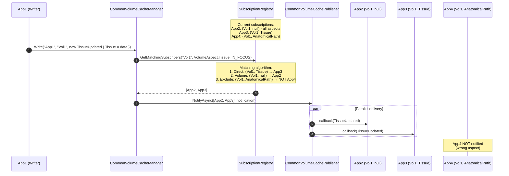
```mermaid
sequenceDiagram
    autonumber
    participant Writer as App1 (Writer)
    participant CCM as CommonVolumeCacheManager
    participant Reg as SubscriptionRegistry
    participant NS as CommonVolumeCachePublisher
    participant VolumeSubscriber as App2 (Vol1, null)
    participant TissueSubscriber as App3 (Vol1, Tissue)
    participant PathSubscriber as App4 (Vol1, AnatomicalPath)
    
    Note over Reg: Current subscriptions:<br/>App2: (Vol1, null) - all aspects<br/>App3: (Vol1, Tissue)<br/>App4: (Vol1, AnatomicalPath)
    
    Writer->>CCM: Write("App1", "Vol1", new TissueUpdated { Tissue = data })
    
    CCM->>Reg: GetMatchingSubscribers("Vol1", VolumeAspect.Tissue, IN_FOCUS)
    
    Note over Reg: Matching algorithm:<br/>1. Direct: (Vol1, Tissue) → App3<br/>2. Volume: (Vol1, null) → App2<br/>3. Exclude: (Vol1, AnatomicalPath) → NOT App4
    
    Reg-->>CCM: [App2, App3]
    
    CCM->>NS: NotifyAsync([App2, App3], notification)
    
    par Parallel delivery
        NS->>VolumeSubscriber: callback(TissueUpdated)
        NS->>TissueSubscriber: callback(TissueUpdated)
    end
    
    Note over PathSubscriber: App4 NOT notified<br/>(wrong aspect)
```

---

## 6. Error Handling Flows

### 6.1 Notification Failure (Fire-and-Forget)

**Requirements:** US-011, US-017

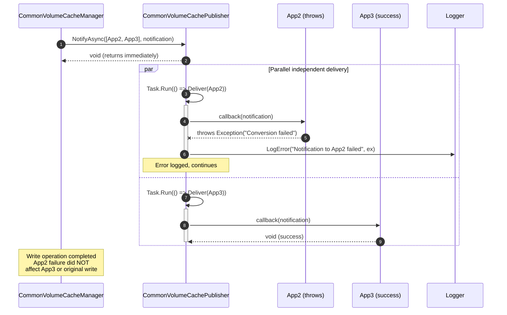
```mermaid
sequenceDiagram
    autonumber
    participant CCM as CommonVolumeCacheManager
    participant NS as CommonVolumeCachePublisher
    participant App2 as App2 (throws)
    participant App3 as App3 (success)
    participant Log as Logger
    
    CCM->>NS: NotifyAsync([App2, App3], notification)
    NS-->>CCM: void (returns immediately)
    
    par Parallel independent delivery
        NS->>NS: Task.Run(() => Deliver(App2))
        activate NS
        NS->>App2: callback(notification)
        App2--xNS: throws Exception("Conversion failed")
        NS->>Log: LogError("Notification to App2 failed", ex)
        deactivate NS
        Note over NS: Error logged, continues
    and
        NS->>NS: Task.Run(() => Deliver(App3))
        activate NS
        NS->>App3: callback(notification)
        App3-->>NS: void (success)
        deactivate NS
    end
    
    Note over CCM: Write operation completed<br/>App2 failure did NOT<br/>affect App3 or original write
```

### 6.2 Concurrent Subscribe/Notification

**Requirements:** US-019

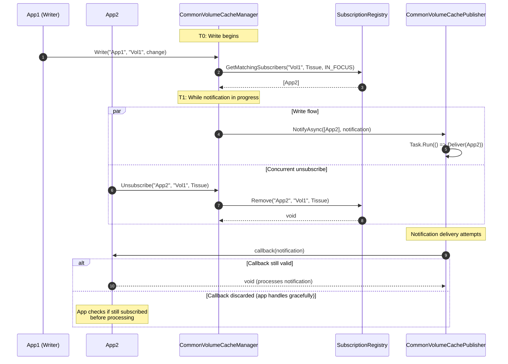
```mermaid
sequenceDiagram
    autonumber
    participant App1 as App1 (Writer)
    participant App2 as App2
    participant CCM as CommonVolumeCacheManager
    participant Reg as SubscriptionRegistry
    participant NS as CommonVolumeCachePublisher
    
    Note over CCM: T0: Write begins
    App1->>CCM: Write("App1", "Vol1", change)
    
    CCM->>Reg: GetMatchingSubscribers("Vol1", Tissue, IN_FOCUS)
    Reg-->>CCM: [App2]
    
    Note over CCM: T1: While notification in progress
    
    par Write flow
        CCM->>NS: NotifyAsync([App2], notification)
        NS->>NS: Task.Run(() => Deliver(App2))
    and Concurrent unsubscribe
        App2->>CCM: Unsubscribe("App2", "Vol1", Tissue)
        CCM->>Reg: Remove("App2", "Vol1", Tissue)
        Reg-->>CCM: void
    end
    
    Note over NS: Notification delivery attempts
    NS->>App2: callback(notification)
    
    alt Callback still valid
        App2-->>NS: void (processes notification)
    else Callback discarded (app handles gracefully)
        Note over App2: App checks if still subscribed<br/>before processing
    end
```

---

## 7. Generator Pre-Loading Flow

This flow describes how generators pre-load data and register subscriptions for applications before they are launched by the user.

### 7.1 Framework Initialization with First Application

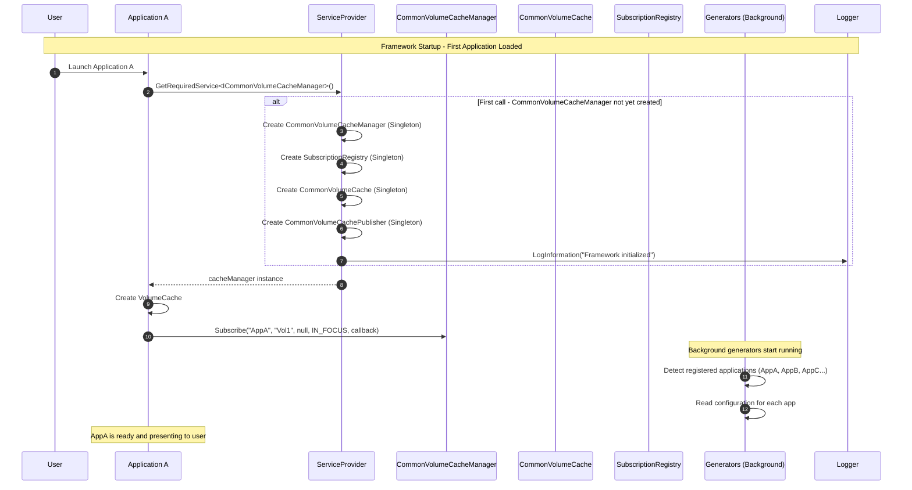
```mermaid
sequenceDiagram
    autonumber
    participant User as User
    participant AppA as Application A
    participant DI as ServiceProvider
    participant CCM as CommonVolumeCacheManager
    participant Cache as CommonVolumeCache
    participant Reg as SubscriptionRegistry
    participant Gen as Generators (Background)
    participant Log as Logger
    
    Note over User,Log: Framework Startup - First Application Loaded
    
    User->>AppA: Launch Application A
    
    AppA->>DI: GetRequiredService<ICommonVolumeCacheManager>()
    
    alt First call - CommonVolumeCacheManager not yet created
        DI->>DI: Create CommonVolumeCacheManager (Singleton)
        DI->>DI: Create SubscriptionRegistry (Singleton)
        DI->>DI: Create CommonVolumeCache (Singleton)
        DI->>DI: Create CommonVolumeCachePublisher (Singleton)
        DI->>Log: LogInformation("Framework initialized")
    end
    
    DI-->>AppA: cacheManager instance
    
    AppA->>AppA: Create VolumeCache
    AppA->>CCM: Subscribe("AppA", "Vol1", null, IN_FOCUS, callback)
    
    Note over Gen: Background generators start running
    
    Gen->>Gen: Detect registered applications (AppA, AppB, AppC...)
    Gen->>Gen: Read configuration for each app
    
    Note over AppA: AppA is ready and presenting to user
```

### 7.2 Generator Pre-Loading for Unloaded Applications

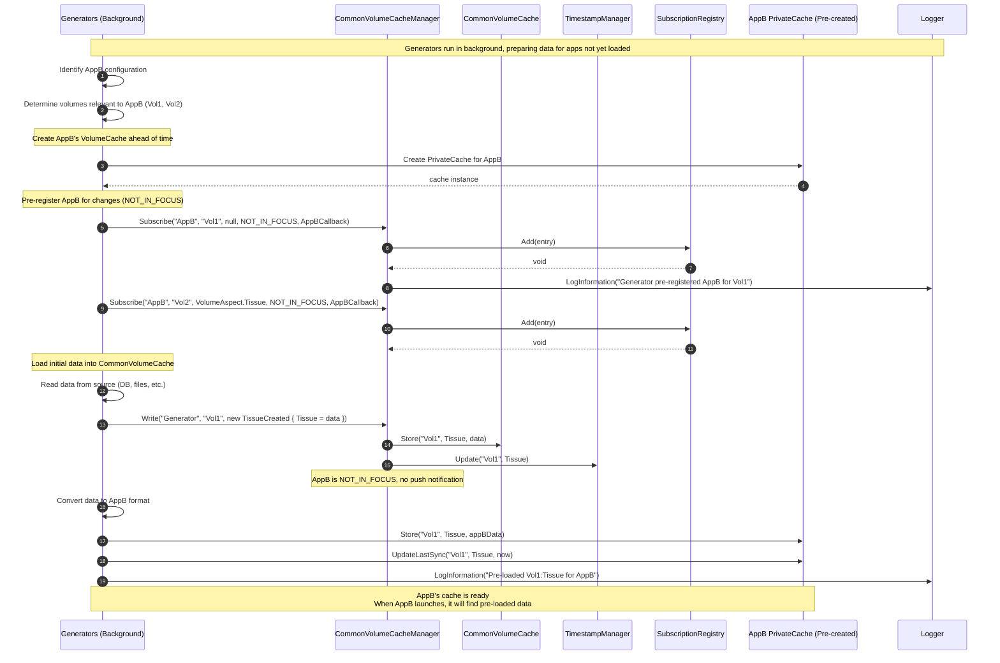
```mermaid
sequenceDiagram
    autonumber
    participant Gen as Generators (Background)
    participant CCM as CommonVolumeCacheManager
    participant Cache as CommonVolumeCache
    participant TS as TimestampManager
    participant Reg as SubscriptionRegistry
    participant AppBCache as AppB PrivateCache (Pre-created)
    participant Log as Logger
    
    Note over Gen,Log: Generators run in background, preparing data for apps not yet loaded
    
    Gen->>Gen: Identify AppB configuration
    Gen->>Gen: Determine volumes relevant to AppB (Vol1, Vol2)
    
    Note over Gen: Create AppB's VolumeCache ahead of time
    
    Gen->>AppBCache: Create PrivateCache for AppB
    AppBCache-->>Gen: cache instance
    
    Note over Gen: Pre-register AppB for changes (NOT_IN_FOCUS)
    
    Gen->>CCM: Subscribe("AppB", "Vol1", null, NOT_IN_FOCUS, AppBCallback)
    CCM->>Reg: Add(entry)
    Reg-->>CCM: void
    CCM->>Log: LogInformation("Generator pre-registered AppB for Vol1")
    
    Gen->>CCM: Subscribe("AppB", "Vol2", VolumeAspect.Tissue, NOT_IN_FOCUS, AppBCallback)
    CCM->>Reg: Add(entry)
    Reg-->>CCM: void
    
    Note over Gen: Load initial data into CommonVolumeCache
    
    Gen->>Gen: Read data from source (DB, files, etc.)
    Gen->>CCM: Write("Generator", "Vol1", new TissueCreated { Tissue = data })
    CCM->>Cache: Store("Vol1", Tissue, data)
    CCM->>TS: Update("Vol1", Tissue)
    
    Note over CCM: AppB is NOT_IN_FOCUS, no push notification
    
    Gen->>Gen: Convert data to AppB format
    Gen->>AppBCache: Store("Vol1", Tissue, appBData)
    Gen->>AppBCache: UpdateLastSync("Vol1", Tissue, now)
    
    Gen->>Log: LogInformation("Pre-loaded Vol1:Tissue for AppB")
    
    Note over Gen,AppBCache: AppB's cache is ready<br/>When AppB launches, it will find pre-loaded data
```

### 7.3 Application Launch with Pre-Loaded Data

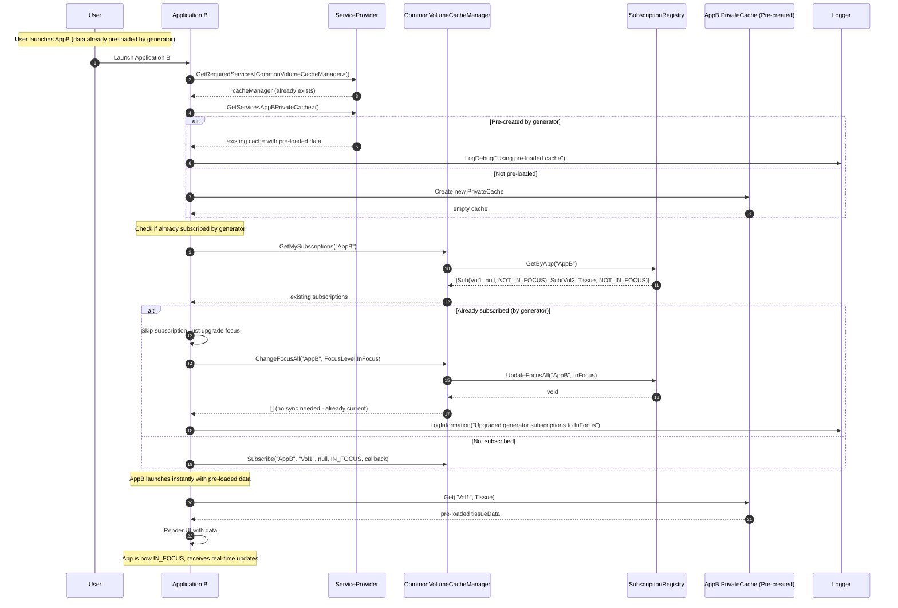
```mermaid
sequenceDiagram
    autonumber
    participant User as User
    participant AppB as Application B
    participant DI as ServiceProvider
    participant CCM as CommonVolumeCacheManager
    participant Reg as SubscriptionRegistry
    participant AppBCache as AppB PrivateCache (Pre-created)
    participant Log as Logger
    
    Note over User: User launches AppB (data already pre-loaded by generator)
    
    User->>AppB: Launch Application B
    
    AppB->>DI: GetRequiredService<ICommonVolumeCacheManager>()
    DI-->>AppB: cacheManager (already exists)
    
    AppB->>DI: GetService<AppBPrivateCache>()
    
    alt Pre-created by generator
        DI-->>AppB: existing cache with pre-loaded data
        AppB->>Log: LogDebug("Using pre-loaded cache")
    else Not pre-loaded
        AppB->>AppBCache: Create new PrivateCache
        AppBCache-->>AppB: empty cache
    end
    
    Note over AppB: Check if already subscribed by generator
    
    AppB->>CCM: GetMySubscriptions("AppB")
    CCM->>Reg: GetByApp("AppB")
    Reg-->>CCM: [Sub(Vol1, null, NOT_IN_FOCUS), Sub(Vol2, Tissue, NOT_IN_FOCUS)]
    CCM-->>AppB: existing subscriptions
    
    alt Already subscribed (by generator)
        AppB->>AppB: Skip subscription, just upgrade focus
        AppB->>CCM: ChangeFocusAll("AppB", FocusLevel.InFocus)
        CCM->>Reg: UpdateFocusAll("AppB", InFocus)
        Reg-->>CCM: void
        CCM-->>AppB: [] (no sync needed - already current)
        AppB->>Log: LogInformation("Upgraded generator subscriptions to InFocus")
    else Not subscribed
        AppB->>CCM: Subscribe("AppB", "Vol1", null, IN_FOCUS, callback)
    end
    
    Note over AppB: AppB launches instantly with pre-loaded data
    
    AppB->>AppBCache: Get("Vol1", Tissue)
    AppBCache-->>AppB: pre-loaded tissueData
    
    AppB->>AppB: Render UI with data
    
    Note over AppB: App is now IN_FOCUS, receives real-time updates
```

### 7.4 Generator Update While Application Not Loaded

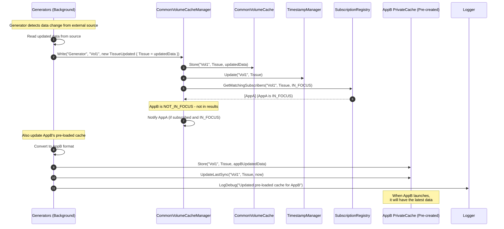
```mermaid
sequenceDiagram
    autonumber
    participant Gen as Generators (Background)
    participant CCM as CommonVolumeCacheManager
    participant Cache as CommonVolumeCache
    participant TS as TimestampManager
    participant Reg as SubscriptionRegistry
    participant AppBCache as AppB PrivateCache (Pre-created)
    participant Log as Logger
    
    Note over Gen: Generator detects data change from external source
    
    Gen->>Gen: Read updated data from source
    
    Gen->>CCM: Write("Generator", "Vol1", new TissueUpdated { Tissue = updatedData })
    CCM->>Cache: Store("Vol1", Tissue, updatedData)
    CCM->>TS: Update("Vol1", Tissue)
    
    CCM->>Reg: GetMatchingSubscribers("Vol1", Tissue, IN_FOCUS)
    Reg-->>CCM: [AppA] (AppA is IN_FOCUS)
    Note over CCM: AppB is NOT_IN_FOCUS - not in results
    
    CCM->>CCM: Notify AppA (if subscribed and IN_FOCUS)
    
    Note over Gen: Also update AppB's pre-loaded cache
    
    Gen->>Gen: Convert to AppB format
    Gen->>AppBCache: Store("Vol1", Tissue, appBUpdatedData)
    Gen->>AppBCache: UpdateLastSync("Vol1", Tissue, now)
    
    Gen->>Log: LogDebug("Updated pre-loaded cache for AppB")
    
    Note over AppBCache: When AppB launches,<br/>it will have the latest data
```

---

## 8. Application Lifecycle Flow

### 8.1 Application Startup

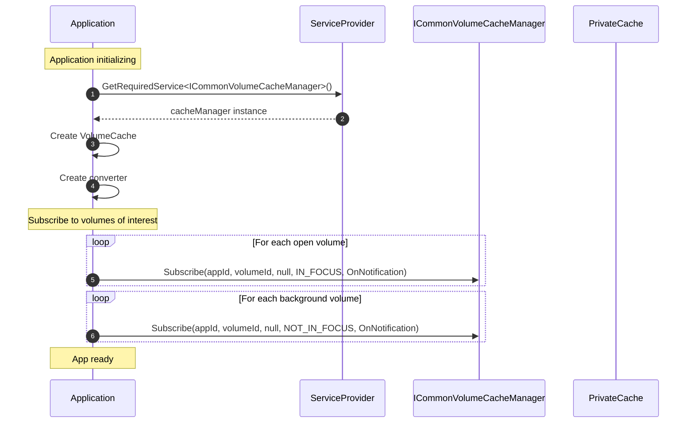
```mermaid
sequenceDiagram
    autonumber
    participant App as Application
    participant DI as ServiceProvider
    participant CCM as ICommonVolumeCacheManager
    participant PC as PrivateCache
    
    Note over App: Application initializing
    
    App->>DI: GetRequiredService<ICommonVolumeCacheManager>()
    DI-->>App: cacheManager instance
    
    App->>App: Create VolumeCache
    App->>App: Create converter
    
    Note over App: Subscribe to volumes of interest
    
    loop For each open volume
        App->>CCM: Subscribe(appId, volumeId, null, IN_FOCUS, OnNotification)
    end
    
    loop For each background volume
        App->>CCM: Subscribe(appId, volumeId, null, NOT_IN_FOCUS, OnNotification)
    end
    
    Note over App: App ready
```

### 8.2 Application Shutdown (UnsubscribeAll)

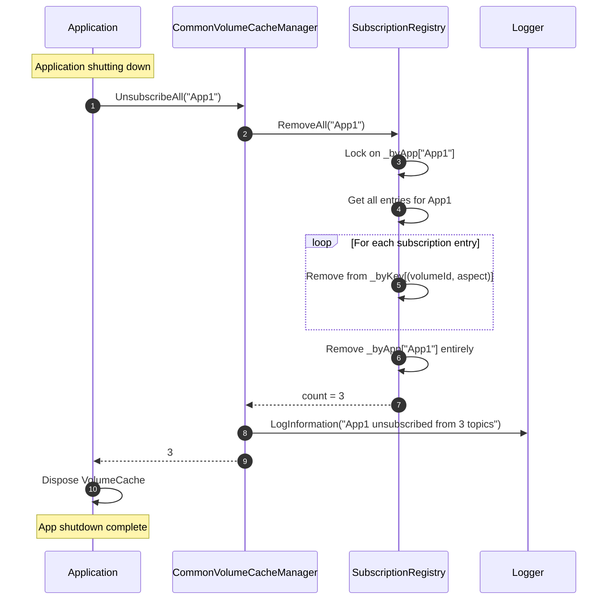
```mermaid
sequenceDiagram
    autonumber
    participant App as Application
    participant CCM as CommonVolumeCacheManager
    participant Reg as SubscriptionRegistry
    participant Log as Logger
    
    Note over App: Application shutting down
    
    App->>CCM: UnsubscribeAll("App1")
    
    CCM->>Reg: RemoveAll("App1")
    Reg->>Reg: Lock on _byApp["App1"]
    Reg->>Reg: Get all entries for App1
    
    loop For each subscription entry
        Reg->>Reg: Remove from _byKey[(volumeId, aspect)]
    end
    
    Reg->>Reg: Remove _byApp["App1"] entirely
    Reg-->>CCM: count = 3
    
    CCM->>Log: LogInformation("App1 unsubscribed from 3 topics")
    CCM-->>App: 3
    
    App->>App: Dispose VolumeCache
    
    Note over App: App shutdown complete
```

### 8.3 Application Focus Change (ChangeFocusAll)

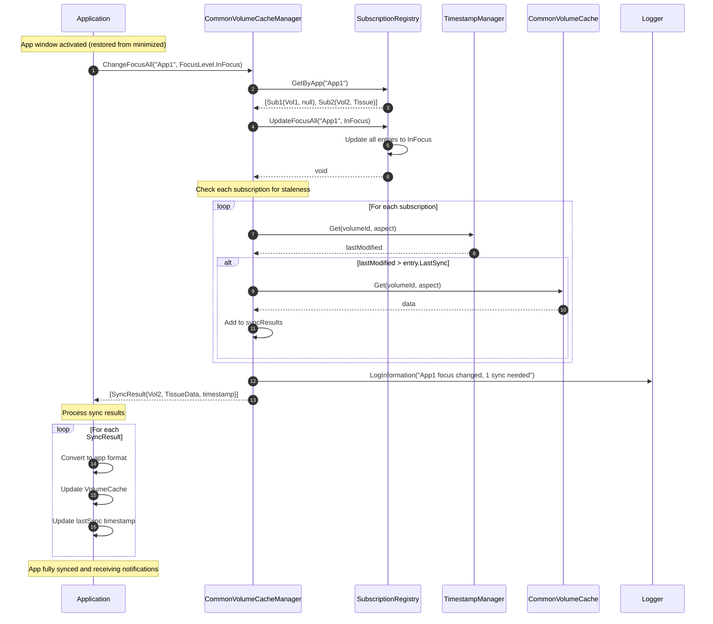
```mermaid
sequenceDiagram
    autonumber
    participant App as Application
    participant CCM as CommonVolumeCacheManager
    participant Reg as SubscriptionRegistry
    participant TS as TimestampManager
    participant Cache as CommonVolumeCache
    participant Log as Logger
    
    Note over App: App window activated (restored from minimized)
    
    App->>CCM: ChangeFocusAll("App1", FocusLevel.InFocus)
    
    CCM->>Reg: GetByApp("App1")
    Reg-->>CCM: [Sub1(Vol1, null), Sub2(Vol2, Tissue)]
    
    CCM->>Reg: UpdateFocusAll("App1", InFocus)
    Reg->>Reg: Update all entries to InFocus
    Reg-->>CCM: void
    
    Note over CCM: Check each subscription for staleness
    
    loop For each subscription
        CCM->>TS: Get(volumeId, aspect)
        TS-->>CCM: lastModified
        
        alt lastModified > entry.LastSync
            CCM->>Cache: Get(volumeId, aspect)
            Cache-->>CCM: data
            CCM->>CCM: Add to syncResults
        end
    end
    
    CCM->>Log: LogInformation("App1 focus changed, 1 sync needed")
    CCM-->>App: [SyncResult{Vol2, TissueData, timestamp}]
    
    Note over App: Process sync results
    
    loop For each SyncResult
        App->>App: Convert to app format
        App->>App: Update VolumeCache
        App->>App: Update lastSync timestamp
    end
    
    Note over App: App fully synced and receiving notifications
```

### 8.4 Application Minimized (ChangeFocusAll to NotInFocus)

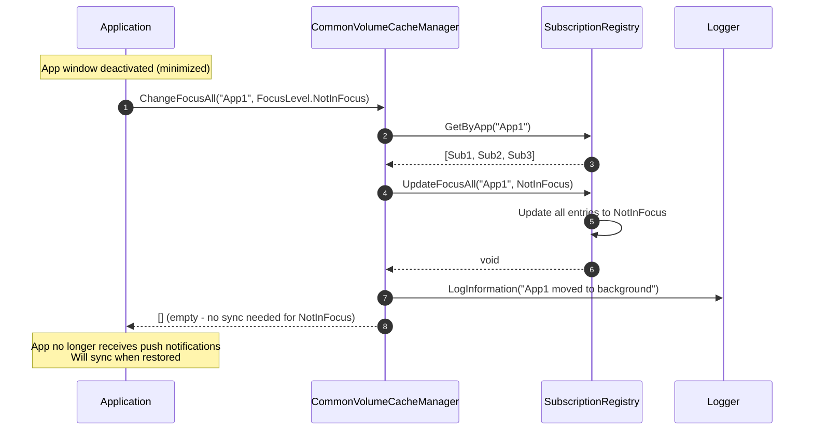
```mermaid
sequenceDiagram
    autonumber
    participant App as Application
    participant CCM as CommonVolumeCacheManager
    participant Reg as SubscriptionRegistry
    participant Log as Logger
    
    Note over App: App window deactivated (minimized)
    
    App->>CCM: ChangeFocusAll("App1", FocusLevel.NotInFocus)
    
    CCM->>Reg: GetByApp("App1")
    Reg-->>CCM: [Sub1, Sub2, Sub3]
    
    CCM->>Reg: UpdateFocusAll("App1", NotInFocus)
    Reg->>Reg: Update all entries to NotInFocus
    Reg-->>CCM: void
    
    CCM->>Log: LogInformation("App1 moved to background")
    CCM-->>App: [] (empty - no sync needed for NotInFocus)
    
    Note over App: App no longer receives push notifications<br/>Will sync when restored
```

---

## Revision History

| Version | Date | Author | Changes |
|---------|------|--------|--------|
| 1.0 | 2026-03-23 | | Initial sequence diagrams |
| 1.1 | 2026-03-23 | | Added UnsubscribeAll, ChangeFocusAll sequences |
| 1.2 | 2026-03-23 | | Added Generator Pre-Loading Flow (section 7) |
