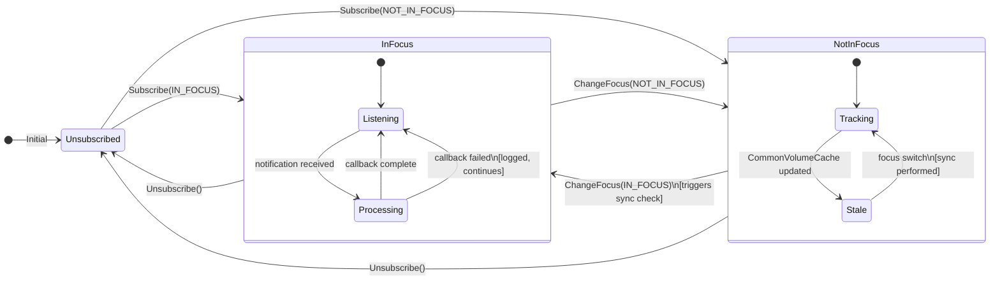
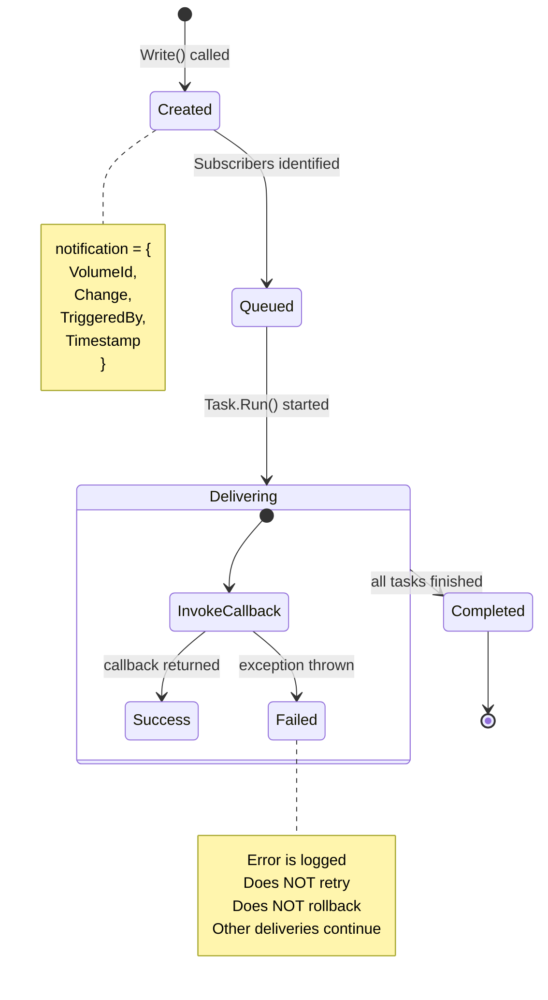
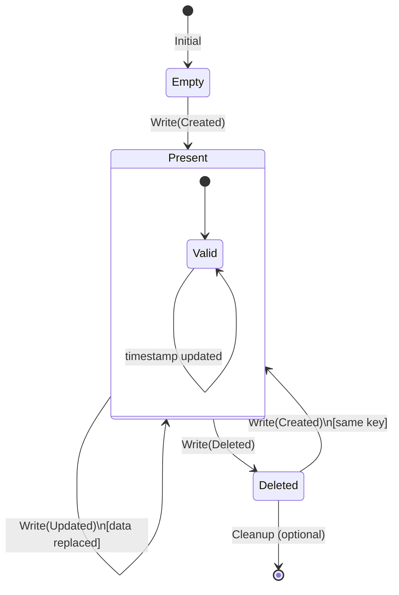
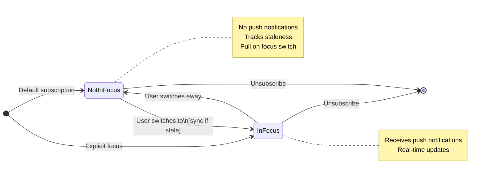
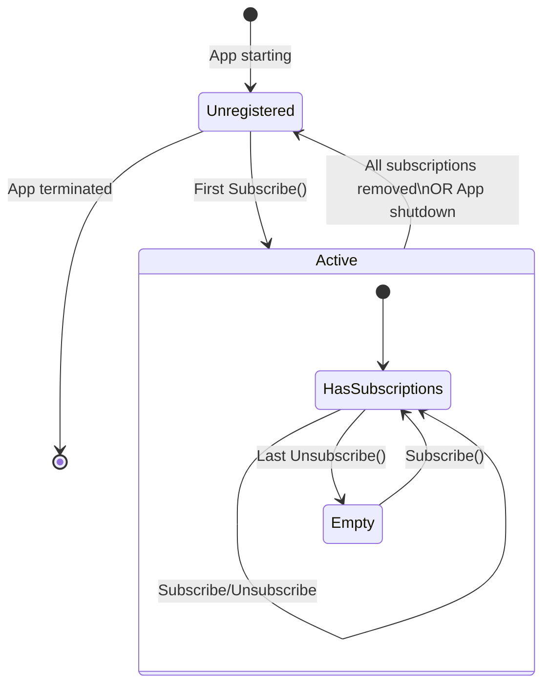
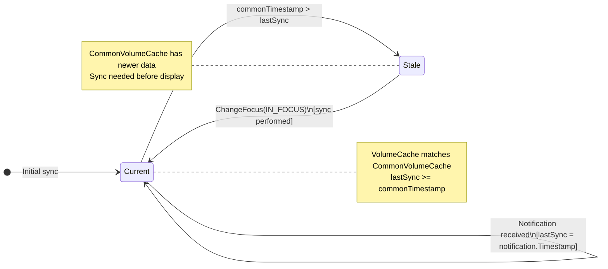
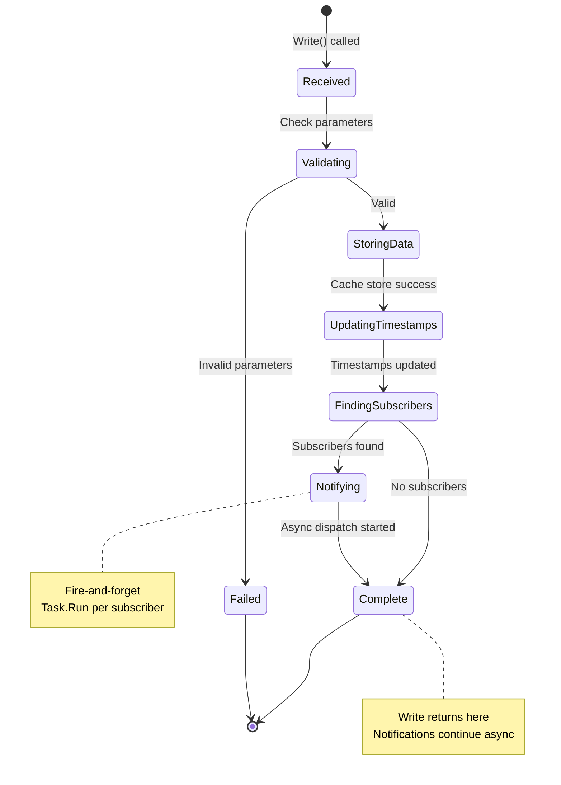
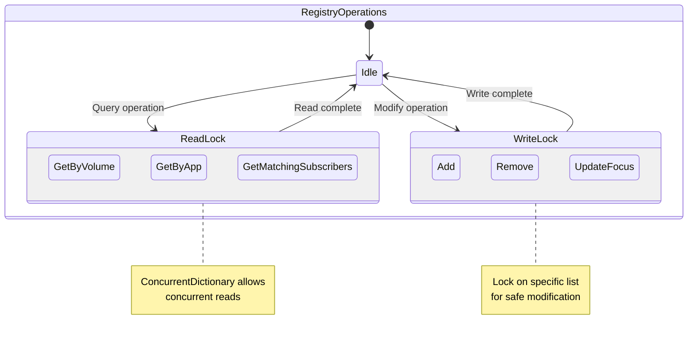

# State Diagrams: Distribution Data Cache and Sync Framework

**Date:** 2026-03-23
**Version:** 1.0
**Architecture Reference:** [architecture.md](../architecture.md)
**Requirements Reference:** [requirements.md](../requirements.md)

---

## Overview

This document contains state diagrams for the key entities and lifecycles in the framework.

---

## 1. Subscription Lifecycle

**Requirements:** US-006 to US-009

### State Descriptions

| State | Description | Behavior |
|-------|-------------|----------|
| **Unsubscribed** | App has no subscription for this topic | No notifications, no tracking |
| **InFocus** | Actively listening for real-time updates | Push notifications delivered async |
| **NotInFocus** | Tracking but not actively presenting | No push; pull on focus switch |
| **Listening** | Ready to receive notifications | Waiting for callback invocation |
| **Processing** | Callback executing | May convert data, update VolumeCache |
| **Tracking** | Monitoring for staleness | Compares timestamps on focus switch |
| **Stale** | CommonVolumeCache newer than last sync | Needs sync before display |

---

## 2. Notification Delivery Lifecycle

**Requirements:** US-010, US-011, US-017

### Notification States

| State | Description | Next Actions |
|-------|-------------|--------------|
| **Created** | NotificationData object constructed | Query registry for subscribers |
| **Queued** | Subscribers identified, ready to dispatch | Start async tasks |
| **Delivering** | Task.Run() executing callback | Wait for completion |
| **Success** | Callback completed without exception | Log success |
| **Failed** | Callback threw exception | Log error, continue |
| **Completed** | All delivery tasks finished | Cleanup |

---

## 3. Cache Entry Lifecycle

**Requirements:** US-002, US-005

### Cache States

| State | Description | Timestamp |
|-------|-------------|-----------|
| **Empty** | No data for this (VolumeId, Aspect) key | N/A |
| **Present** | Data exists in cache | Updated on every write |
| **Valid** | Data is complete and accessible | Current |
| **Deleted** | Tombstone or removed | Final timestamp before delete |

---

## 4. Focus Level State Machine

**Requirements:** US-009

---

## 5. Application Registration Lifecycle

---

## 6. Data Sync State (Per Subscription)

**Requirements:** US-013, US-014

### Sync Decision Matrix

| Focus Level | Timestamp Comparison | Action |
|-------------|---------------------|--------|
| IN_FOCUS | N/A | Push notification updates lastSync |
| NOT_IN_FOCUS → IN_FOCUS | lastSync < commonTimestamp | Pull data, update cache |
| NOT_IN_FOCUS → IN_FOCUS | lastSync >= commonTimestamp | No sync needed |
| NOT_IN_FOCUS | Any change | No action (defer to focus switch) |

---

## 7. Write Operation States

**Requirements:** US-005

---

## 8. Subscription Registry Concurrency States

**Requirements:** US-019

---

## State Transition Summary

### Quick Reference Table

| Entity | States | Key Transitions |
|--------|--------|-----------------|
| **Subscription** | Unsubscribed → InFocus/NotInFocus | Subscribe, Unsubscribe, ChangeFocus |
| **Notification** | Created → Queued → Delivering → Completed | Automatic on Write |
| **Cache Entry** | Empty → Present → Deleted | Created, Updated, Deleted |
| **Focus Level** | InFocus ↔ NotInFocus | ChangeFocus (atomic) |
| **Data Sync** | Current ↔ Stale | Cache update / Focus switch |

---

## Revision History

| Version | Date | Author | Changes |
|---------|------|--------|---------|
| 1.0 | 2026-03-23 | | Initial state diagrams |
