# Distribution Data Cache and Sync — Detailed Design Document

**Version:** 1.0 | **Date:** 2026-03-26 | **Authors:** Architecture Team  
**Status:** Ready for Review | **Phase:** Design Complete

---

## Table of Contents

1. [Background](#1-background)
2. [Requirements](#2-requirements)
3. [High-Level Diagrams](#3-high-level-diagrams)
4. [Discovery & Research](#4-discovery--research)
5. [Solution Principles](#5-solution-principles)
6. [Alternatives Analysis](#6-alternatives-analysis)
7. [Selected Solution](#7-selected-solution)
8. [API Contracts](#8-api-contracts)
9. [Data Structures](#9-data-structures)
10. [Sequence Flows](#10-sequence-flows)
11. [State Diagrams](#11-state-diagrams)
12. [Error Handling](#12-error-handling)
13. [Open Issues](#13-open-issues)
14. [Appendix](#14-appendix)

---

## 1. Background

### 1.1 Context

Multiple applications (X, Y, Z) share a single cache keyed by Volume ID. Each application stores:
- Its own app-specific objects (mapped to common format)
- Common data objects

### 1.2 Problem Statement

| Problem | Impact |
|---------|--------|
| **Cache Pollution** | App-specific objects mixed with shared data; apps store irrelevant data |
| **Over-Notification** | All apps notified on any change, even for volumes they're not presenting |
| **No Selective Interest** | Apps cannot specify which volumes they care about in real-time |

### 1.3 Business Scenario

- Users work with multiple applications simultaneously
- Each app presents different volumes (e.g., Tissue Viewer shows Volume 1, Anatomical Editor shows Volume 2)
- Changes must propagate in real-time to apps actively presenting affected data
- Background apps should sync efficiently on focus switch

### 1.4 Stakeholders

| Stakeholder | Interest | Priority |
|-------------|----------|----------|
| Application Teams | Efficient cache access and notifications | High |
| End Users | Real-time updates on active views | High |
| Platform Team | Owns cache infrastructure and framework | High |
| DevOps | Monitoring, performance, scalability | Medium |

### 1.5 POC Scope

- **Applications:** 2 apps
- **Volumes:** 3 volumes
- **Timeline:** 2-3 weeks
- **Key Constraint:** Must filter triggering app to avoid cyclic updates

---

## 2. Requirements

### 2.1 Business Requirements

| ID | Requirement | Priority |
|----|-------------|----------|
| BR-1 | Real-time sync for active views | Must Have |
| BR-2 | No cyclic notifications (self-notification prevention) | Must Have |
| BR-3 | App isolation (VolumeCaches per app) | Must Have |
| BR-4 | Efficient background sync on focus switch | Must Have |

### 2.2 System Requirements

| ID | Requirement | Target |
|----|-------------|--------|
| SR-1 | Notification latency | <100ms |
| SR-2 | Focus switch sync time | <500ms |
| SR-3 | Cache type | In-memory (ConcurrentDictionary) |
| SR-4 | Threading model | Async fire-and-forget per subscriber |

### 2.3 User Stories Summary (24 stories across 10 epics)

| Epic | Stories | Key Requirements |
|------|---------|------------------|
| **1. Cache Architecture** | US-001, US-002 | VolumeCache per app, CommonVolumeCache for shared data |
| **2. Data Conversion** | US-003, US-004 | App ↔ Common format conversion |
| **3. Write Path** | US-005 | Write to private + CommonVolumeCache atomically |
| **4. Subscription Management** | US-006 to US-009 | Subscribe, Unsubscribe, ChangeFocus |
| **5. In Focus Notifications** | US-010 to US-012 | Real-time push, async delivery, no self-notify |
| **6. Focus Switch (Pull)** | US-013, US-014 | Pull-on-switch, timestamp tracking |
| **7. Subscription Registry** | US-015, US-016 | Query subscribers, list own subscriptions |
| **8. Error Handling** | US-017, US-018 | Notification failures, conversion failures |
| **9. Race Conditions** | US-019 | Concurrent subscribe/unsubscribe handling |
| **10. Hierarchical Matching** | US-020 to US-024 | Volume-level + Aspect-level subscriptions |

### 2.4 Security Requirements

| Requirement | Implementation |
|-------------|----------------|
| Apps cannot access other apps' VolumeCaches | Isolation by AppId |
| CommonVolumeCache access is controlled | Through ICommonVolumeCacheManager interface only |

### 2.5 Serviceability

| Area | Approach |
|------|----------|
| Logging | Microsoft.Extensions.Logging; log all operations with AppId, VolumeId |
| Monitoring | Track subscription counts, notification latency, cache hit rates |
| Alerts | Failed notifications, conversion errors |

---

## 3. High-Level Diagrams

### 3.1 System Context Diagram

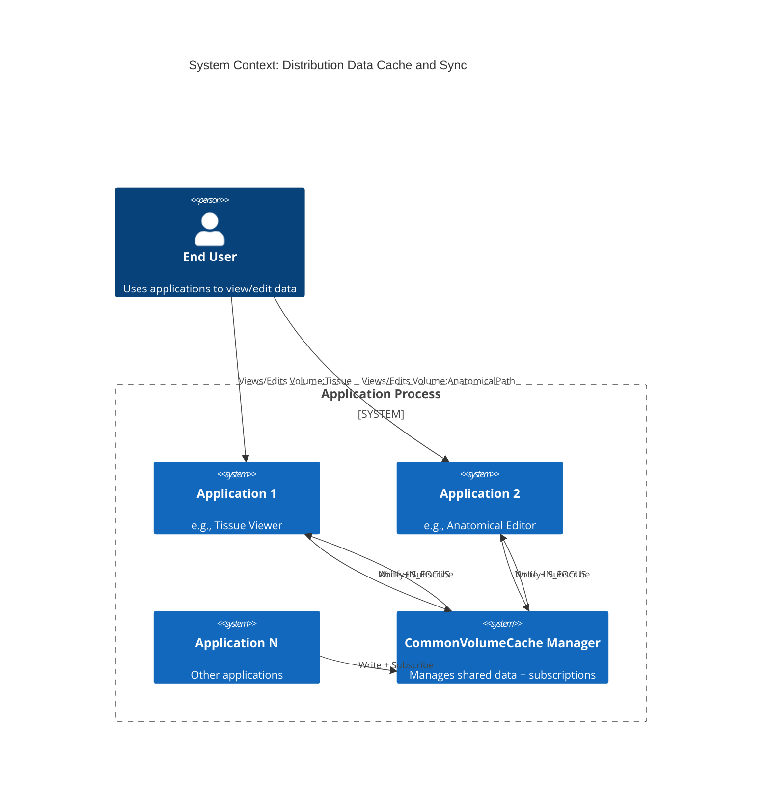

### 3.2 Conceptual Component Diagram

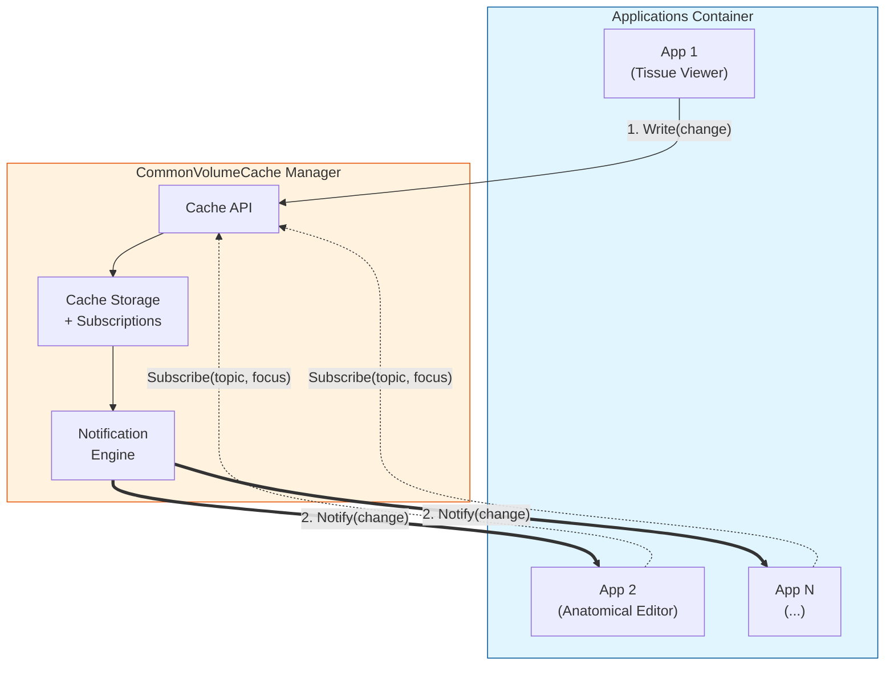

### 3.3 Detailed Component Diagram

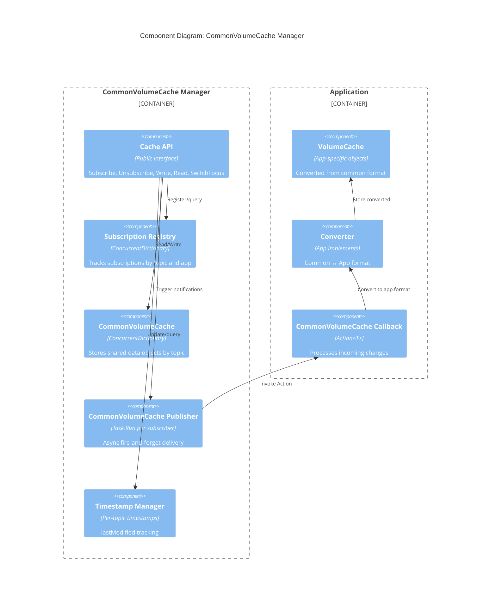

### 3.4 Class Diagram

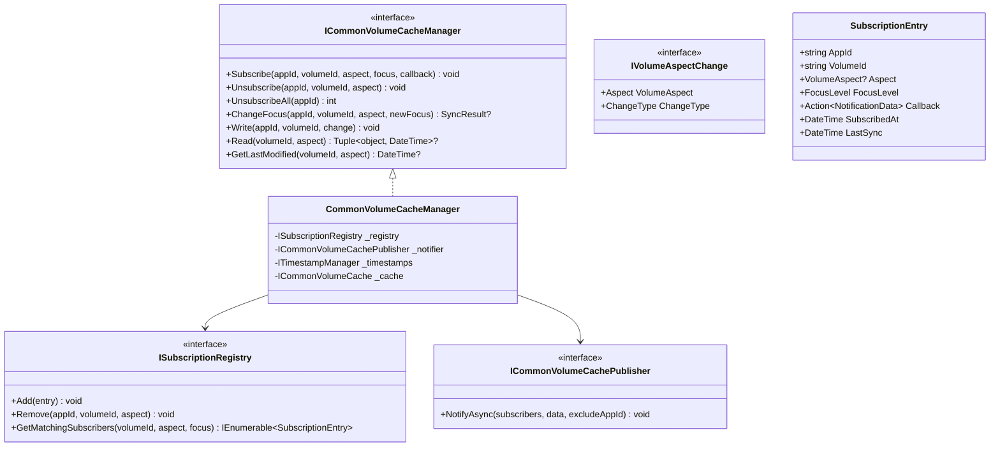

---

## 4. Discovery & Research

### 4.1 Current State Analysis

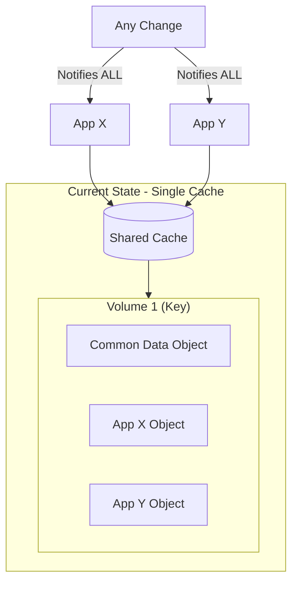

**Problems Identified:**
- Mixed cache pollution
- Over-notification (all apps, all volumes)
- No selective interest mechanism

### 4.2 Assumptions

| # | Assumption | Risk if Wrong |
|---|------------|---------------|
| 1 | Single-process deployment | Would need distributed cache if multi-process |
| 2 | Apps always have unique AppId | Identity conflicts |
| 3 | Conversion is deterministic | Data inconsistency |
| 4 | In-memory sufficient for data size | Would need Redis/persistent cache |

---

## 5. Solution Principles

| Principle | How Addressed |
|-----------|---------------|
| **Scalability** | Async notifications prevent blocking; focus tiers reduce load |
| **Security** | VolumeCache isolation; no cross-app access |
| **Performance** | Fire-and-forget; <100ms notification target; <500ms sync |
| **Architecture** | Clean interfaces; registry pattern; dependency injection |
| **Resilience** | One app failure doesn't affect others; error isolation |
| **Stateless Design** | No session state; subscriptions are explicit and queryable |
| **Code Excellence** | Type-safe change objects; pattern matching; no string parsing |

---

## 6. Alternatives Analysis

### 6.1 Approaches Evaluated

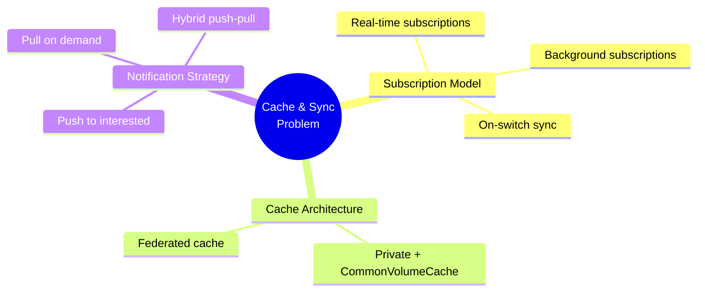

### 6.2 Comparison Matrix

| Criteria | Weight | Approach 1<br>(Full Push) | Approach 2<br>(Two-Tier) | Approach 3<br>(Pull) | Approach 4<br>(Events) |
|----------|--------|---------------------------|--------------------------|----------------------|------------------------|
| Meets must-have criteria | 5 | ✅ | ✅ | ❌ | ✅ |
| Real-time for active volume | 4 | 10 | 10 | 2 | 8 |
| Simplicity | 3 | 7 | 5 | 10 | 2 |
| Efficiency | 3 | 6 | 9 | 10 | 7 |
| **Weighted Score** | | **159** | **155** | **126** | **103** |

### 6.3 Decision

**Selected: Approach 2 — Two-Tier Subscription (Focus + Background)**

| Rejected Approach | Reason |
|-------------------|--------|
| Full Push | Inefficient — notifies even when not needed |
| Pull-Only | Fails real-time requirement for active views |
| Event Sourcing | Over-engineering — major architectural change not justified |

---

## 7. Selected Solution

### 7.1 Two-Tier Subscription Model

| Tier | Behavior | Implementation |
|------|----------|----------------|
| **IN_FOCUS** | Real-time async push notifications | Task.Run() per subscriber |
| **NOT_IN_FOCUS** | Pull-on-switch using timestamps | Compare lastSync vs lastModified |

### 7.2 Normal Flow — Multi-App Cache Synchronization

This sequence diagram illustrates the core concept of the selected solution:

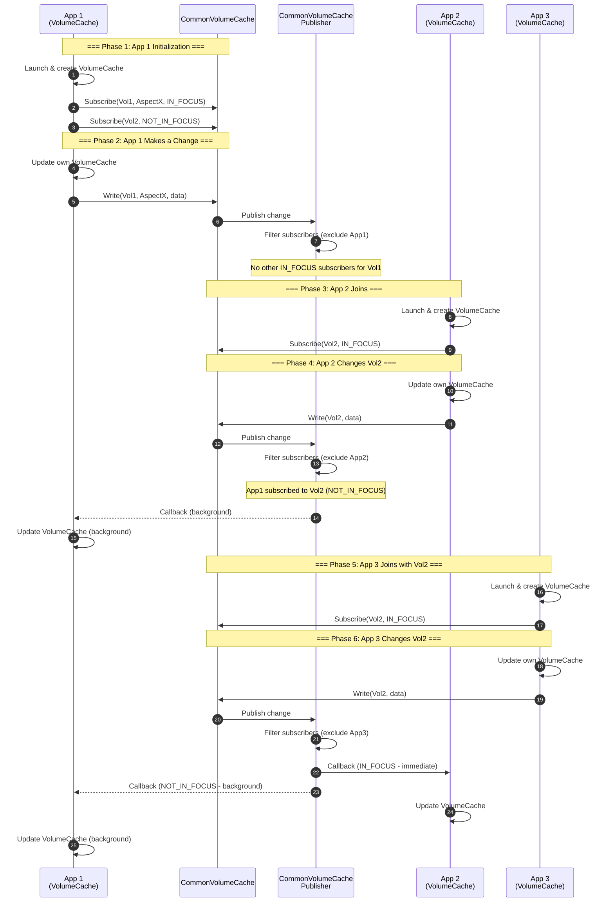

**Key Points:**
- Each app maintains its **own VolumeCache** for app-specific objects
- Changes are **propagated to CommonVolumeCache** for sharing
- Publisher **filters out the triggering app** to prevent cyclic updates
- **IN_FOCUS** subscribers receive immediate callbacks
- **NOT_IN_FOCUS** subscribers receive background updates

### 7.3 Key Design Decisions (ADRs)

#### ADR-0001: Async Fire-and-Forget Execution

**Decision:** Use `Task.Run()` for each IN_FOCUS notification independently.

**Rationale:**
- One slow/blocked app does NOT delay others
- Triggering app returns immediately
- Each notification is independent
- Failures are isolated and logged

```csharp
foreach (var subscriber in inFocusSubscribers.Except(triggeredBy))
{
    _ = Task.Run(async () => 
    {
        try { await NotifyAppAsync(subscriber, data); }
        catch (Exception ex) { _logger.LogError(ex, "Failed"); }
    });
}
```

#### ADR-0002: Registry-Based Subscriptions (No C# Events)

**Decision:** Use registry with Action delegates instead of C# events.

| Issue with Events | Impact |
|-------------------|--------|
| No app identity | Can't filter self-notifications |
| Coupled invocation | All handlers invoked synchronously |
| No metadata | Can't associate focus level with handler |

### 7.4 Technology Stack

| Layer | Technology | Rationale |
|-------|------------|-----------|
| Language | C# / .NET | Existing codebase, team expertise |
| Cache | `ConcurrentDictionary` | Simple, fast, thread-safe |
| Subscriptions | Registry pattern | Explicit identity, rich metadata |
| Threading | `Task.Run()` | Fire-and-forget per ADR-0001 |
| Logging | Microsoft.Extensions.Logging | Standard .NET |

---

## 8. API Contracts

### 8.1 ICommonVolumeCacheManager

```csharp
public interface ICommonVolumeCacheManager
{
    /// <summary>
    /// Subscribes an application to receive notifications for a volume or specific aspect.
    /// </summary>
    void Subscribe(
        string appId, 
        string volumeId, 
        VolumeAspect? aspect,  // null = all aspects
        FocusLevel focus, 
        Action<NotificationData> callback);
    
    /// <summary>
    /// Removes a subscription. Idempotent.
    /// </summary>
    void Unsubscribe(string appId, string volumeId, VolumeAspect? aspect = null);
    
    /// <summary>
    /// Removes ALL subscriptions for an application (e.g., on shutdown).
    /// </summary>
    int UnsubscribeAll(string appId);
    
    /// <summary>
    /// Changes focus level, optionally triggering sync.
    /// Returns sync data if switching to InFocus and data is stale.
    /// </summary>
    SyncResult? ChangeFocus(string appId, string volumeId, VolumeAspect? aspect, FocusLevel newFocus);
    
    /// <summary>
    /// Writes a change to the CommonVolumeCache and notifies subscribers.
    /// </summary>
    void Write(string appId, string volumeId, IVolumeAspectChange change);
    
    /// <summary>
    /// Reads data from CommonVolumeCache (for focus switch sync).
    /// </summary>
    (object Data, DateTime Timestamp)? Read(string volumeId, VolumeAspect? aspect = null);
}
```

### 8.2 IVolumeAspectChange (Type-Safe Changes)

```csharp
public interface IVolumeAspectChange
{
    VolumeAspect Aspect { get; }
    ChangeType ChangeType { get; }
}

// Example implementations
public class TissueCreated : IVolumeAspectChange
{
    public VolumeAspect Aspect => VolumeAspect.Tissue;
    public ChangeType ChangeType => ChangeType.Created;
    public required TissueData Tissue { get; init; }
}

public class TissueUpdated : IVolumeAspectChange { ... }
public class TissueDeleted : IVolumeAspectChange { ... }
```

### 8.3 Enums

```csharp
public enum VolumeAspect { Tissue, AnatomicalPath, TBD }
public enum FocusLevel { InFocus, NotInFocus }
public enum ChangeType { Created, Updated, Deleted }
```

---

## 9. Data Structures

### 9.1 Entity Relationship Diagram

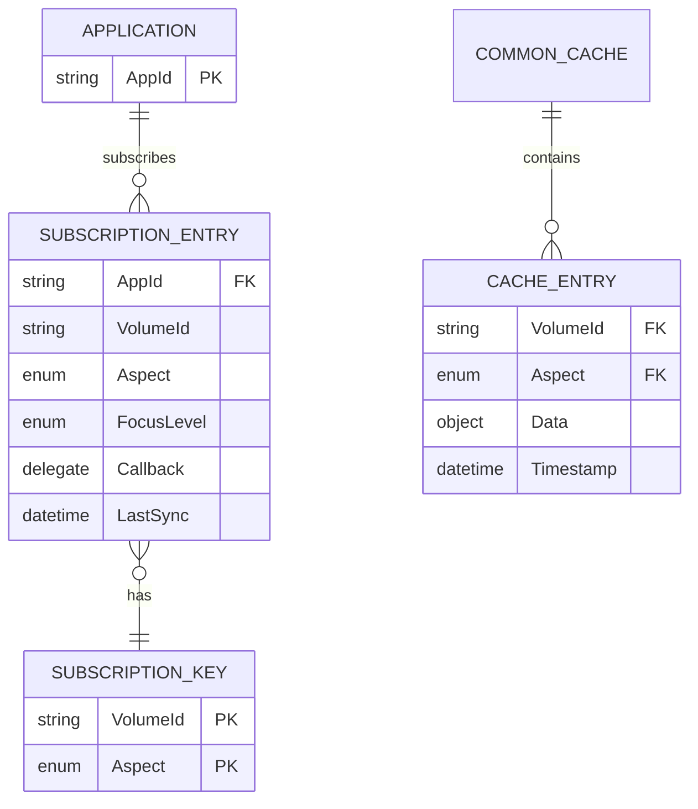

### 9.2 In-Memory Storage

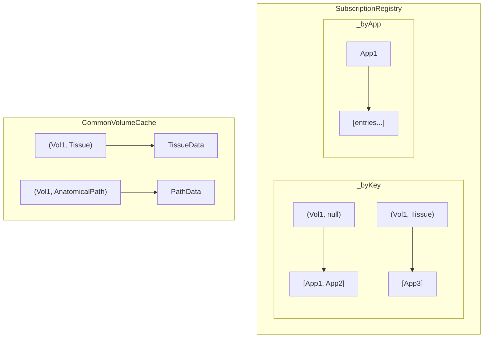

---

## 10. Sequence Flows

### 10.1 Write Flow with Notifications

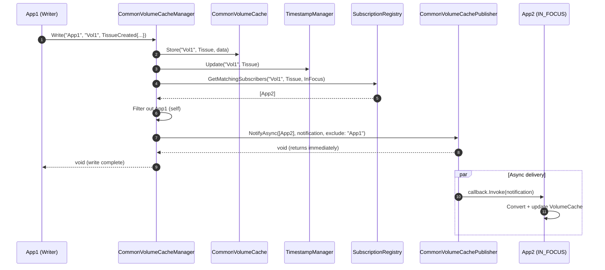

### 10.2 Focus Switch Flow

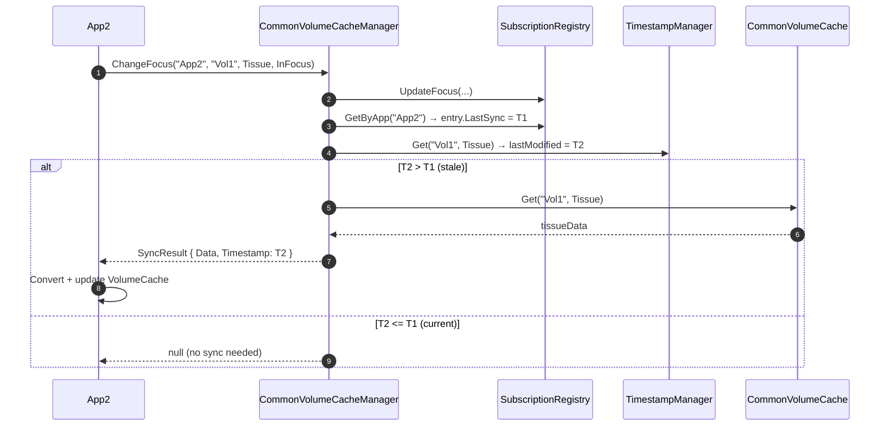

---

## 11. State Diagrams

### 11.1 Subscription Lifecycle

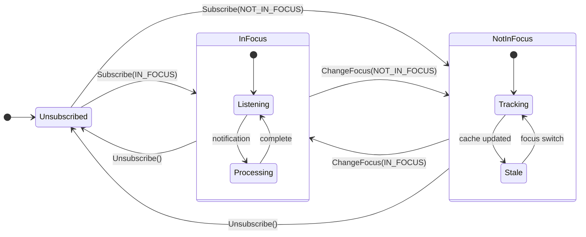

---

## 12. Error Handling

### 12.1 Failure Scenarios

| Scenario | Detection | Recovery | Support Level |
|----------|-----------|----------|---------------|
| CommonVolumeCache Callback throws | try/catch in Task.Run | Log error, continue with others | L2 |
| Conversion failure on write | App catches exception | VolumeCache updated, CommonVolumeCache NOT | L2 |
| Conversion failure on read | App catches exception | VolumeCache NOT updated | L2 |
| Registry concurrency conflict | ConcurrentDictionary handles | Automatic retry | L1 |

### 12.2 Logging Strategy

| Event | Log Level | Content |
|-------|-----------|---------|
| Subscription added | Information | AppId, VolumeId, Aspect, Focus |
| Write completed | Information | AppId, VolumeId, Aspect, subscriber count |
| Notification failed | Error | AppId, VolumeId, Exception details |
| Focus switch sync | Debug | AppId, VolumeId, stale/current |

### 12.3 Recovery

- **No retries** for failed notifications (fire-and-forget)
- **No rollback** of write on notification failure
- **Graceful handling** of in-flight notifications after unsubscribe

---

## 13. Open Issues

### 13.1 Missing Information

| # | Issue | Impact | Owner |
|---|-------|--------|-------|
| 1 | Exact error code taxonomy | Low | TBD |
| 2 | Metrics collection approach | Medium | DevOps |

### 13.2 Open Decisions

| # | Decision | Options | Status |
|---|----------|---------|--------|
| 1 | Retry mechanism for failed notifications | None / 1x retry / DLQ | Open |
| 2 | Notification timeout | None / 5s / 30s | Open |

### 13.3 Dependencies

| # | Dependency | Status |
|---|------------|--------|
| 1 | Microsoft.Extensions.Logging | Available |
| 2 | .NET 6+ | Available |

### 13.4 Required Improvements (Post-MVP)

| # | Improvement | Priority |
|---|-------------|----------|
| 1 | Dead letter queue for failed notifications | Low |
| 2 | Metrics dashboard | Medium |
| 3 | Performance benchmarks | Medium |

---

## 14. Appendix

### 14.1 ADR References

| ADR | Title | Status |
|-----|-------|--------|
| [ADR-0001](adr/0001-async-notification-execution-model.md) | Async Notification Execution Model | Accepted |
| [ADR-0002](adr/0002-registry-based-subscription-pattern.md) | Registry-Based Subscription Pattern | Accepted |

### 14.2 Related Documents

| Document | Location |
|----------|----------|
| Brainstorming | [brainstorming.md](brainstorming.md) |
| Requirements | [requirements.md](requirements.md) |
| Architecture | [architecture.md](architecture.md) |
| Class Diagrams | [diagrams/class-diagrams.md](diagrams/class-diagrams.md) |
| Sequence Diagrams | [diagrams/sequence-diagrams.md](diagrams/sequence-diagrams.md) |
| State Diagrams | [diagrams/state-diagrams.md](diagrams/state-diagrams.md) |
| API Contracts | [diagrams/api-contracts.md](diagrams/api-contracts.md) |
| Data Model | [diagrams/data-model.md](diagrams/data-model.md) |
| Traceability | [diagrams/traceability.md](diagrams/traceability.md) |

### 14.3 Diagram Tools

- **Mermaid** — all diagrams in this document
- Rendered in VS Code, GitHub, or any Mermaid-compatible viewer

---

**Next Steps:** Approve detailed design → Begin Phase 6 (Implementation)
