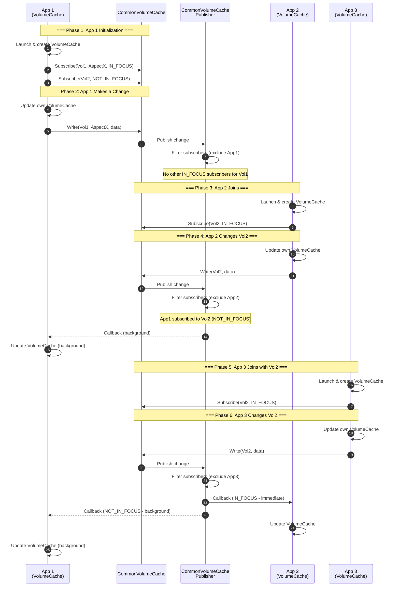

# Distribution Data Cache and Sync — Design Review Summary

**Version:** 1.0 | **Date:** 2026-03-25 | **Status:** Ready for Review

---

## 1. What Are We Building?

Multiple applications share a single cache keyed by Volume ID, causing **cache pollution** (app-specific objects mixed with shared data) and **over-notification** (all apps notified on any change, even for irrelevant volumes).

We are building a **CommonVolumeCache Manager** with a Two-Tier Subscription model:
- **VolumeCaches** per app for app-specific objects
- **CommonVolumeCache** for shared data objects
- **Focus-aware notifications** — only notify apps actively presenting a volume

---

## 2. Key Requirements

| Category | Requirements |
|----------|--------------|
| **Business** | Real-time sync for active views; no cyclic notifications; app isolation |
| **System** | <100ms notification latency; <500ms focus switch; in-memory cache |
| **Security** | Apps cannot access other apps' VolumeCaches |

**POC Scope:** 2 apps, 3 volumes, 2-3 weeks

---

## 3. High-Level Design

### Key Components

| Component | Responsibility |
|-----------|----------------|
| **CommonVolumeCache Manager** | Orchestrates subscriptions, writes, and notifications |
| **Subscription Registry** | Tracks who subscribes to which volumes with focus level |
| **CommonVolumeCache Publisher** | Async fire-and-forget delivery to IN_FOCUS subscribers |
| **VolumeCache** (per app) | Stores app-specific objects in native format |
| **Converter** (per app) | Transforms between app format ↔ common format |

### Solution Overview

**CommonVolumeCache:**
- Shared cache with a **standard data contract**
- Data organized by **Volume** and **Aspect** (e.g., Tissue, AnatomicalPath)

**CommonVolumeCache Manager:**
- Manages **two types of subscriptions**: `IN_FOCUS` (real-time) and `NOT_IN_FOCUS` (background)
- Uses **CommonVolumeCachePublisher** to notify subscribers of changes (excluding the triggering app)

**Application Responsibilities:**
- Each app maintains its **own VolumeCache** with app-specific models
- On any update, the app **converts to the standard data contract** and writes to CommonVolumeCache
- App must **subscribe to relevant volumes/aspects** with the appropriate focus level
- Subscription includes a **callback action** to handle notifications from CommonVolumeCachePublisher

### Normal Flow — Multi-App Cache Synchronization

**Key Points:**
- Each app maintains its **own VolumeCache** for app-specific objects
- Changes are **propagated to CommonVolumeCache** for sharing
- Publisher **filters out the triggering app** to prevent cyclic updates
- **IN_FOCUS** subscribers receive immediate callbacks
- **NOT_IN_FOCUS** subscribers receive background updates

---

## 4. Solution Approach

**Selected:** Two-Tier Subscription (Focus + Background)

| Tier | Behavior |
|------|----------|
| **IN_FOCUS** | Real-time async push notifications |
| **NOT_IN_FOCUS** | Pull-on-switch using timestamps |

| Alternative | Why Not Selected |
|-------------|------------------|
| Full Push (all subscribed) | Inefficient — notifies even when not needed |
| Pull-Only | No real-time updates for active views |
| Event Sourcing | Over-engineering — major architectural change |

### Guiding Principles

| Principle | How Addressed |
|-----------|---------------|
| **Scalability** | Async notifications prevent blocking; focus tiers reduce load |
| **Performance** | Fire-and-forget; <100ms target latency |
| **Isolation** | App filtering prevents cyclic updates; VolumeCaches separate |

---

## 5. Key Decisions (ADRs)

| ADR | Decision | Rationale |
|-----|----------|-----------|
| **ADR-0001** | Async fire-and-forget execution | One slow app won't block others |
| **ADR-0002** | Registry-based subscriptions (no C# events) | Events lack app identity; can't filter self-notifications |

---

## 6. Impact Summary

| Area | Impact |
|------|--------|
| **Apps** | Must implement: Subscribe, Converter, handle notifications |
| **Architecture** | New CommonVolumeCache Manager component |
| **Data** | No schema changes — in-memory structures only |

---

## 7. Open Issues

| # | Issue | Status |
|---|-------|--------|
| 1 | Exact error handling strategy for failed notifications | Open |
| 2 | Metrics/monitoring approach | Open |
| 3 | Migration strategy from current single-cache design | Open |

---

**Next Steps:** Approve design → Begin Phase 6 (Implementation)
